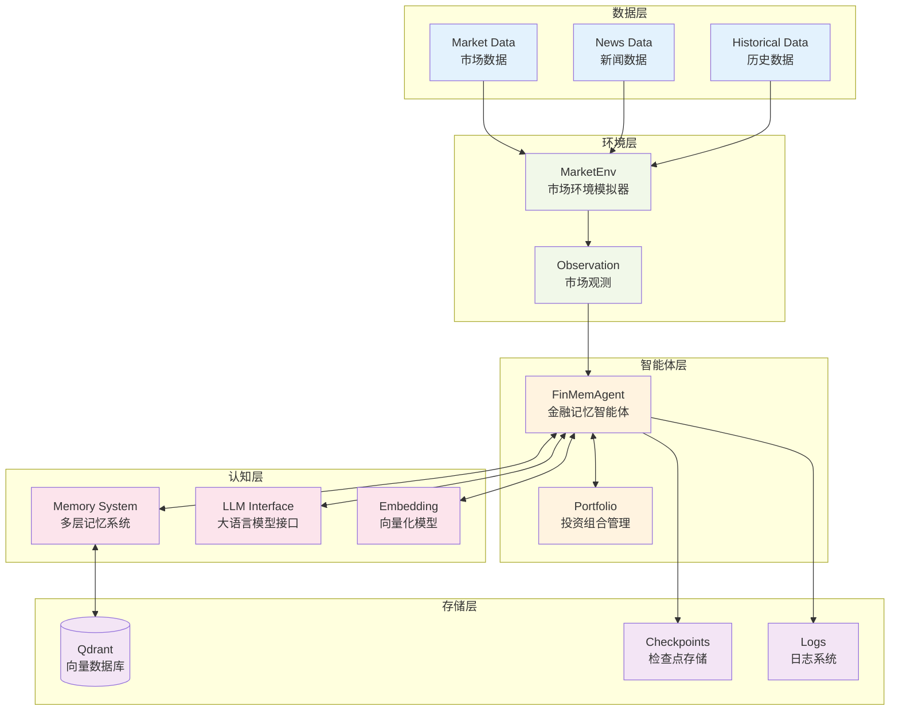
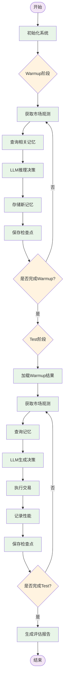

# 📖 INVESTOR-BENCH 项目概述

[返回文档索引](./README.md)

## 🎯 项目简介

INVESTOR-BENCH是一个基于大语言模型(LLM)的智能投资决策评估框架，旨在评估和比较不同LLM在金融投资领域的表现。该框架结合了先进的记忆机制、实时市场数据分析和AI驱动的决策制定。

## 🌟 核心特性

### 1. 智能记忆系统
- **多层次记忆**: 短期、中期、长期和反思记忆
- **向量化存储**: 使用Qdrant向量数据库存储和检索
- **动态更新**: 基于重要性和时效性的记忆衰减机制

### 2. LLM驱动决策
- **统一API**: OpenAI兼容的接口设计
- **多模型支持**: OpenAI、VLLM、硅基流动等多种Provider
- **结构化输出**: 使用Guardrails确保输出格式一致性

### 3. 实时市场环境
- **多资产支持**: 股票、加密货币、ETF等
- **历史数据回测**: 支持指定时间段的历史数据模拟
- **动量指标**: 集成技术分析指标

### 4. 性能评估
- **投资指标**: 收益率、夏普比率、最大回撤等
- **风险管理**: 实时风险监控和控制
- **对比分析**: 多模型、多策略性能对比

## 🏗️ 技术架构

### 系统组件

### 核心工作流

## 📊 支持的资产类型

### 1. 股票 (Equities)
- **支持市场**: 美股市场
- **示例标的**: HON、JNJ、UVV、MSFT
- **数据时间**: 2020-07-01 至 2021-05-06
- **特点**: 包含财务新闻和基本面数据

### 2. 加密货币 (Cryptocurrencies)  
- **支持币种**: BTC、ETH
- **数据时间**: 2023-02-11 至 2023-12-19
- **特点**: 高波动性，24/7交易

### 3. ETF基金
- **数据时间**: 2019-07-29 至 2020-09-21
- **特点**: 多元化投资组合

## 🎮 使用场景

### 1. 学术研究
- **模型评估**: 比较不同LLM在金融领域的表现
- **策略研究**: 测试各种投资策略的有效性
- **行为分析**: 分析AI在投资决策中的行为模式

### 2. 算法交易
- **策略开发**: 开发基于LLM的交易策略
- **风险管理**: 评估策略的风险收益特征
- **回测验证**: 历史数据验证策略表现

### 3. 教育培训
- **投资教学**: 演示投资决策过程
- **AI教育**: 展示AI在金融领域的应用
- **案例研究**: 提供真实的金融决策案例

## 🔧 核心概念

### FinMemAgent (金融记忆智能体)
智能投资代理，具备：
- 记忆管理能力
- LLM推理能力  
- 投资组合管理
- 风险控制机制

### MarketEnv (市场环境)
市场模拟器，提供：
- 实时市场数据
- 新闻事件信息
- 技术指标计算
- 交易执行环境

### Memory System (记忆系统)
多层次记忆架构：
- **短期记忆**: 近期市场信息
- **中期记忆**: 趋势和模式
- **长期记忆**: 重要历史事件
- **反思记忆**: 决策反思和学习

### Portfolio Management (投资组合管理)
投资组合管理功能：
- 资产配置
- 风险控制
- 收益计算
- 交易执行

## 📈 性能指标

### 1. 收益指标
- **总收益率**: 投资期间的总收益
- **年化收益率**: 按年度计算的收益率
- **超额收益**: 相对基准的超额表现

### 2. 风险指标
- **波动率**: 收益的标准差
- **最大回撤**: 最大的峰值到谷值损失
- **夏普比率**: 风险调整后的收益

### 3. 交易指标
- **交易次数**: 总交易频次
- **胜率**: 盈利交易占比
- **平均持仓期**: 平均持有时间

## 🚀 快速开始

1. **环境准备**: 安装依赖和配置API密钥
2. **启动服务**: 运行Qdrant向量数据库
3. **配置模型**: 设置LLM和Embedding模型
4. **运行Warmup**: 初始化智能体的记忆系统
5. **执行Test**: 运行投资决策测试
6. **生成报告**: 分析投资表现

详细步骤请参考 [安装与配置](./02-installation-setup.md) 和 [快速开始](./03-quick-start.md)。

## 📚 相关资源

- [配置系统](./04-configuration.md) - 详细配置指南
- [Agent架构](./05-agent-architecture.md) - 智能体架构详解
- [API接口](./08-api-interfaces.md) - 统一API使用指南
- [命令行参考](./10-cli-reference.md) - CLI命令大全

---

[下一章: 安装与配置 →](./02-installation-setup.md)