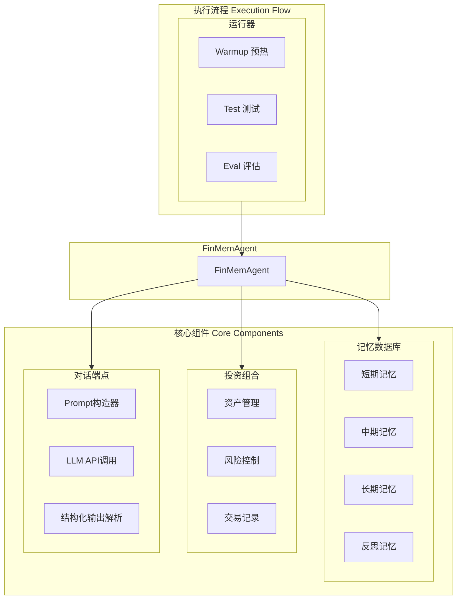
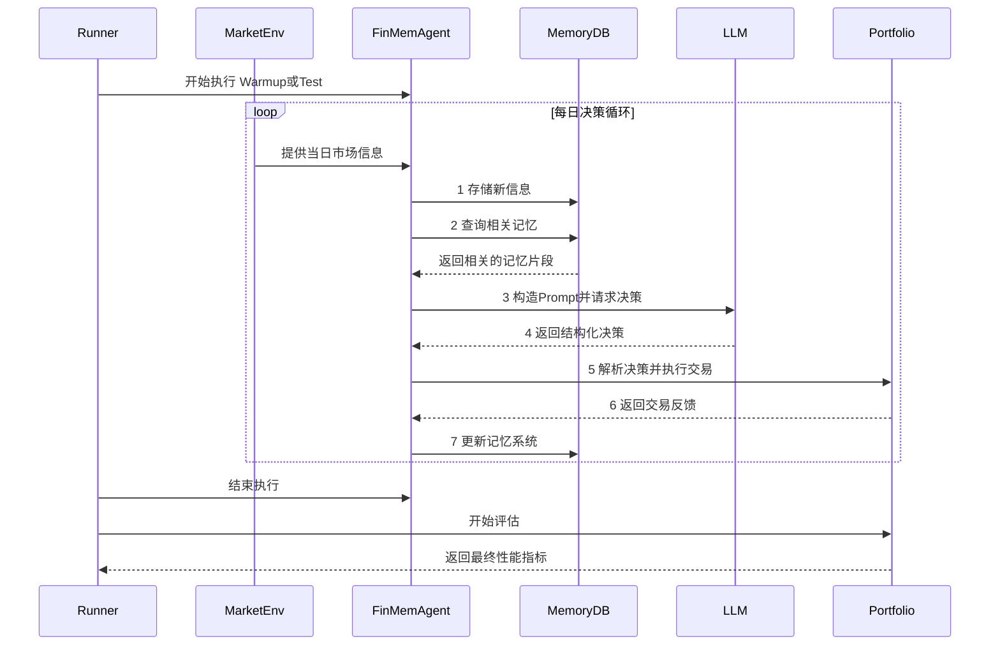
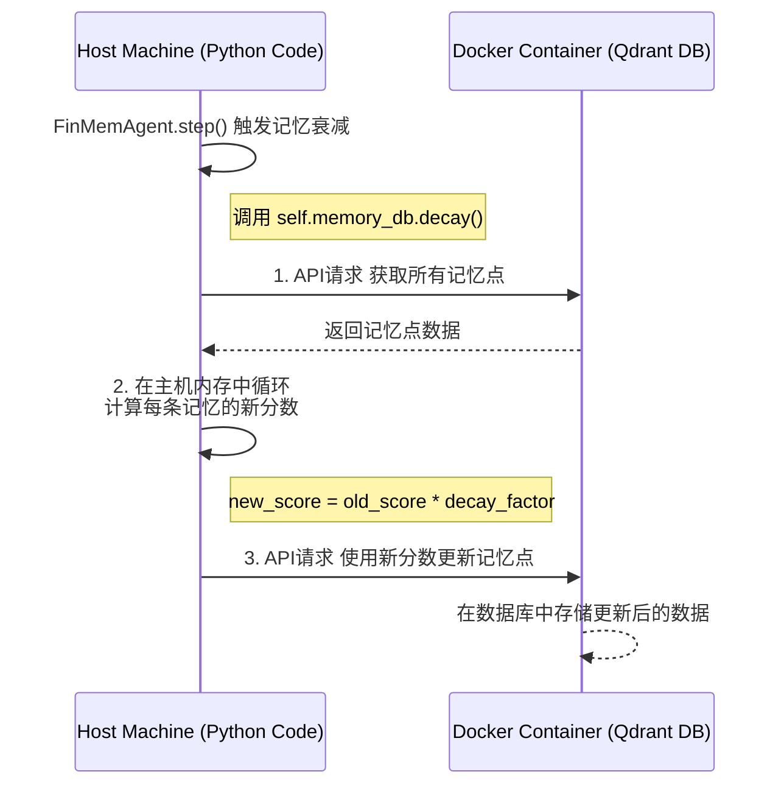
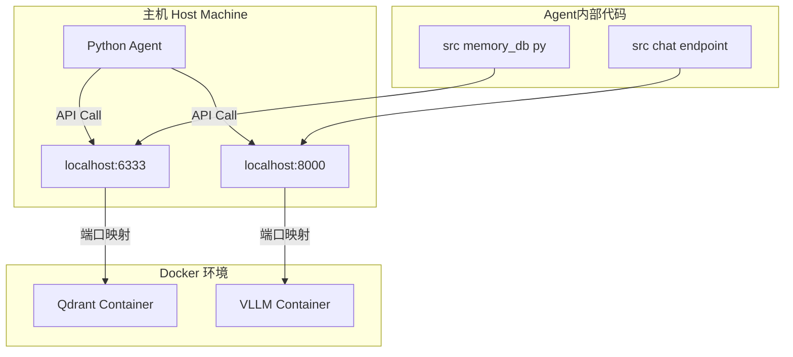

# 05 - Agent 架构：深度解析

本文档是 **FinMemAgent** 的一份深度技术白皮书，旨在为开发者提供全面的架构理解、实现细节和维护指南。通过阅读本文，您将能掌握Agent的决策全流程，从信息输入到记忆管理，再到最终的交易执行。

## 1. 核心理念与设计哲学

FinMemAgent 的设计旨在模拟一位专业的金融分析师。其核心设计哲学包括：

- **记忆驱动决策**: 区别于简单的响应式Agent，FinMemAgent的决策深度整合了从短期观察到长期反思的各层级记忆。这使得Agent的行为更具连续性和深度。
- **结构化思考**: 我们不让大语言模型(LLM)进行无约束的“自由发挥”。通过精心设计的Prompt和强制性的结构化输出，我们引导LLM进行可控、可解析、有逻辑的分析。
- **持续学习与自省**: 记忆系统不是静态的。通过一套完整的衰减、流动和反思机制，Agent能够动态地调整其知识库，从过去的成功与失败中学习。

## 2. 整体架构与代码模块

FinMemAgent由三大核心组件和一大执行流程构成。所有组件的初始化和协调均在 **`run.py`** 中完成。

## 3. 决策工作流 (The Step-by-Step Decision Flow)

Agent的每一个决策周期都由 **`src/agent.py`** 中的 **`FinMemAgent.step()`** 方法驱动。这是Agent思考和行动的核心。

## 4. 核心组件深度解析

### 4.1. 多层级记忆系统 (The Memory System)

记忆系统是FinMemAgent的认知核心，其实现在 **`src/memory_db.py`**。

- **记忆表示**: 每条记忆在`Qdrant`中是一个带有向量的文档，其`payload`（载荷）中存储了丰富的元数据，如：`id`, `symbol`, `date`, `text`, 以及三个核心动态属性：
    1.  **`importance` (重要性)**: 0-1之间的浮点数，代表记忆的价值。
    2.  **`recency` (时效性)**: 0-1之间的浮点数，随时间流逝而衰减。
    3.  **`access_counter` (访问计数)**: 整数，记录该记忆被成功决策引用的次数。

- **记忆生命周期管理**: Agent的长期学习能力源于对记忆的动态管理。
    - **信息输入 (`_handling_new_information`)**: 新闻等信息被赋予初始的`importance`和`recency`后，存入短期记忆库。
    - **记忆检索 (`_query_memories`)**: 检索不仅仅是向量相似度搜索。最终的排序分数由 **`LinearCompoundScore`** 函数计算，是 **向量相似度、重要性、时效性**三者的加权组合。这意味着Agent会优先关注那些与当前情况相关、被证明过有价值、且较为新鲜的记忆。
    - **反馈更新 (`_update_feedback_response`)**: 这是学习的关键环节。当一笔交易被`Portfolio`确认为成功后（仅在`warmup`阶段），所有参与这笔决策的记忆（即证据链中的ID）的`access_counter`都会增加。这直接提升了它们的`importance`分数，使得未来更有可能被再次检索到。
    - **系统维护 (Decay, Clean-up, Flow)**: 在每个`step`结束时执行：
        - **`decay()`**: 所有记忆的`importance`和`recency`分数都会根据`configs/main.json`中设定的衰减因子进行衰减。
        - **`clean_up()`**: `importance`或`recency`低于特定阈值的记忆将被从数据库中删除，防止信息过载。
        - **`memory_flow()`**: 这是知识沉淀的过程。当一条短期记忆因为被频繁成功使用而导致其`importance`分数超过阈值时，它将被**复制**到中期记忆库中。同理，重要的中期记忆也会流向长期记忆库。

#### 4.1.1. 实现细节：计算逻辑与数据存储的分离

一个核心的设计理念是**计算逻辑与数据存储的分离**。Agent的核心思考和计算逻辑（例如记忆如何衰减）运行在主机上，而数据存储服务（Qdrant数据库）则运行在Docker容器中。

**记忆衰减逻辑是如何处理的？**

记忆的“衰减”等动态调整逻辑，**不是在数据库内部自动发生的**，而是在主机上运行的Python代码中计算的。可以把Docker中的Qdrant数据库想象成一个只会“存”和“取”的仓库，而主机上的Agent代码则是那个知道何时以及如何整理仓库的管理员。

这个过程遵循一个清晰的 **“获取-计算-更新” (Fetch-Calculate-Update)** 循环：

1.  **触发时机**: 在每个决策周期结束时，`src/agent.py` 中的 `FinMemAgent.step()` 方法会调用 `self.memory_db.decay()`。
2.  **获取 (Fetch)**: `decay()` 方法（位于 `src/memory_db.py`）向Docker中的Qdrant数据库发起API请求，获取所有需要处理的记忆点。
3.  **计算 (Calculate)**: Python代码在**主机的内存中**遍历这些记忆数据。对于每一条记忆，它会应用在 `configs/main.json` 中定义的衰减公式（例如 `new_importance = old_importance * decay_factor`），计算出新的分数。
4.  **更新 (Update)**: 所有新分数计算完毕后，代码会再次向Qdrant数据库发起API请求，将这些更新后的记忆数据写回数据库。

这个流程清晰地展示了计算与存储的分离：

### 4.2. LLM交互与决策制定

#### 4.2.1. Prompt的构成

Agent的决策质量高度依赖于提供给LLM的Prompt。在 **`src/agent.py`** 的 `_single_asset_trade_action` 等方法中，构造了包含以下信息的Prompt：

1.  **当前市场信息**: 日期、价格、技术指标（如动量）。
2.  **上下文记忆**: 从短期、中期、长期和反思记忆库中检索出的相关信息。
3.  **任务指令**: 明确的角色扮演、思考框架和输出格式要求。
4.  **特殊训练信息 (仅Warmup阶段)**: 在`warmup`阶段，会提供未来信息（如次日价格变动方向）作为“标准答案”，以进行有监督的训练。在`test`阶段，此信息被严格排除。

#### 4.2.2. 一个关键的设计选择：Agent是否知道自身表现？

**在一次深入的架构评审中，一个至关重要的观点被提出：人类基金经理在做决策时，必然会参考自己投资组合的实时表现（如仓位、盈亏）。这个观点促使我们对Agent的决策输入进行了最严格的核查，结论如下：**

**Agent在当前的设计中，并不知道自己实时的投资组合表现。**

经过对`src/agent.py`的最终代码审查可以确认，发送给LLM的Prompt中，**不包含**任何关于Agent自身投资组合的信息，如**当前持仓、现金余额、总资产或实时盈亏**。`self.portfolio`对象在决策制定时是一个黑盒。

这是一个刻意的、重要的架构选择，它将Agent的角色定位为一个纯粹的**“信息分析师”**，而非一个**“投资组合经理”**。

- **优点**: 这种设计严格避免了“未来信息泄露”，确保了对Agent信号生成能力的评估是纯粹和公平的。
- **缺点与现实的差异 (由评审者指出)**: 这与人类基金经理的行为有显著差异。真实的基金经理会将当前的风险暴露（仓位）和资金状况作为决策的关键输入。因此，当前Agent的评估并未涵盖**风险管理和仓位控制**的能力。

这个设计选择意味着，框架目前的核心是测试Agent**“看得准不准”**（市场预测），而不是**“管得好不好”**（组合管理）。对于未来的研究，将投资组合状态作为输入引入到Prompt中，将是一个非常有价值的拓展方向。

## 5. 运行时环境与Docker

为了简化部署，本项目采用混合执行模式：核心Agent逻辑在主机上运行，而后台服务则在Docker容器中运行。

- **主机运行**: 所有的Python代码 (`run.py`, `src/`)。这包括了所有关于**记忆如何变化、何时衰减、如何形成Prompt**等计算和决策逻辑。
- **Docker运行**: 
    1.  **Qdrant向量数据库**: 作为Agent的记忆存储。它只负责数据的“存”和“取”。
    2.  **本地LLM推理服务 (可选)**: 如VLLM，用于在本地托管开源大模型。

### 5.1. Agent与Docker的交互方式

Agent代码**不直接与Docker交互**，而是通过标准的**网络API调用**与运行在容器内部的服务进行通信。Docker的端口映射功能是实现这种解耦的关键。

- **与Qdrant的交互**:
    - **代码位置**: **`src/memory_db.py`**
    - **交互逻辑**: `MemoryDB`类使用`qdrant_client`库，根据`configs/main.json`中的配置连接到Qdrant服务。所有数据库操作都通过该客户端转化为网络请求。

- **与本地LLM的交互**:
    - **代码位置**: **`src/chat/endpoint/`**
    - **交互逻辑**: 相关的Endpoint模块使用`openai`库（以兼容模式）向`configs/main.json`中`chat_api_base`指定的地址发送HTTP请求。

## 6. 如何维护与定制Agent

- **调整Agent行为**: Agent的大部分核心行为都可以通过修改 **`configs/main.json`** 文件来调整，无需改动代码。
    - **想让Agent更关注近期事件？**: 提高`short`记忆的`decay_recency_factor`。
    - **想让Agent更“激进”地学习？**: 提高`memory_importance_score_update_step`。
    - **想改变知识沉淀的速度？**: 调整`jump_upper_threshold`。

- **修改思考逻辑**: 如果想改变Agent的分析问题的角度，可以直接修改 **`src/chat/prompt`** 中的Prompt模板。

- **调试Agent决策**: 当Agent做出不符合预期的决策时，最佳的调试方法是查看 **`results/.../log/test_trace.log`** 文件。该日志详细记录了每个决策周期中的所有关键信息，可以帮助快速定位问题。