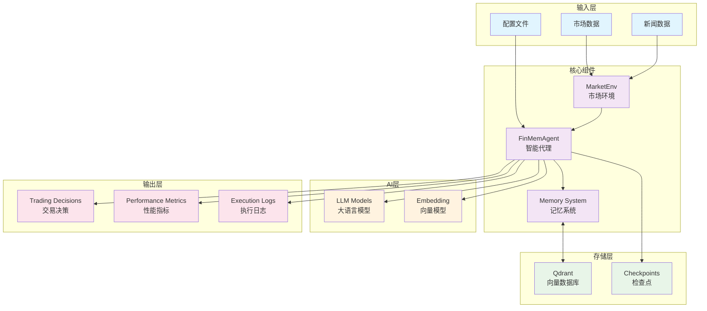
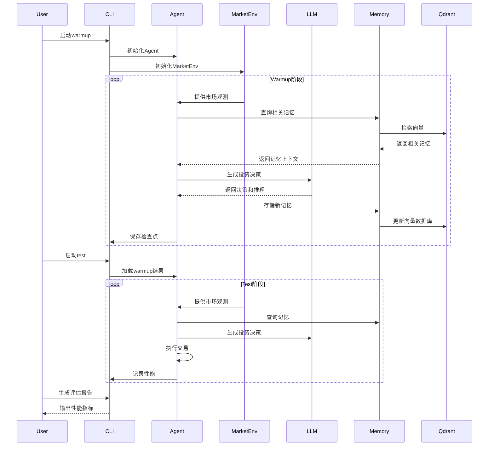

# INVESTOR-BENCH 项目文档

## 📚 文档索引

- [📖 项目概述](./01-project-overview.md) - 项目介绍、架构和核心概念
- [⚙️ 安装与配置](./02-installation-setup.md) - 环境搭建和配置指南  
- [🚀 快速开始](./03-quick-start.md) - 快速上手指南
- [🔧 配置系统](./04-configuration.md) - 详细配置说明
- [🤖 Agent架构](./05-agent-architecture.md) - FinMemAgent架构详解
- [📈 市场环境](./06-market-environment.md) - MarketEnv组件说明
- [🧠 记忆系统](./07-memory-system.md) - 记忆数据库原理和使用
- [🔌 API接口](./08-api-interfaces.md) - 统一API接口使用指南
- [📊 评估指标](./09-evaluation-metrics.md) - 性能评估和指标分析
- [🛠️ 命令行参考](./10-cli-reference.md) - 完整CLI命令参考
- [🐛 故障排除](./11-troubleshooting.md) - 常见问题和解决方案
- [🔬 开发指南](./12-development-guide.md) - 开发者指南和代码结构

## 🎯 项目简介

INVESTOR-BENCH是一个基于大语言模型(LLM)的智能投资决策评估框架，具有以下核心特性：

### 🌟 核心特性

- **🧠 智能记忆系统**: 多层次记忆机制，支持短期、中期、长期和反思记忆
- **🤖 LLM驱动决策**: 使用大语言模型进行投资决策推理
- **📊 实时市场数据**: 支持股票、加密货币等多种资产类型  
- **⚡ 统一API接口**: OpenAI兼容的统一API调用
- **📈 性能评估**: 全面的投资性能指标分析
- **🔧 灵活配置**: 支持多种模型Provider和参数配置

### 🏗️ 系统架构

### 🎮 工作流程

## 🚀 快速导航

### 新用户推荐路径
1. [项目概述](./01-project-overview.md) - 了解基本概念
2. [安装与配置](./02-installation-setup.md) - 搭建环境
3. [快速开始](./03-quick-start.md) - 运行第一个实验
4. [配置系统](./04-configuration.md) - 自定义配置

### 开发者推荐路径  
1. [Agent架构](./05-agent-architecture.md) - 理解核心架构
2. [API接口](./08-api-interfaces.md) - 了解接口设计
3. [开发指南](./12-development-guide.md) - 代码结构和扩展

### 运维推荐路径
1. [命令行参考](./10-cli-reference.md) - 掌握所有命令
2. [故障排除](./11-troubleshooting.md) - 解决常见问题

## 📞 技术支持

如果在使用过程中遇到问题，请按照以下顺序排查：

1. 查阅相关文档章节
2. 检查[故障排除](./11-troubleshooting.md)
3. 查看日志文件获取详细错误信息
4. 运行系统自带的测试脚本

---

📝 **文档版本**: v2.0  
📅 **最后更新**: 2025-01-06  
👨‍💻 **维护者**: 项目开发团队