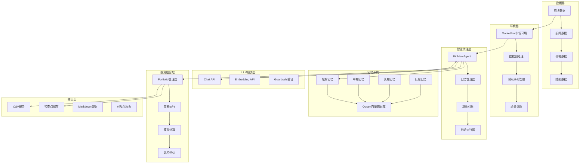
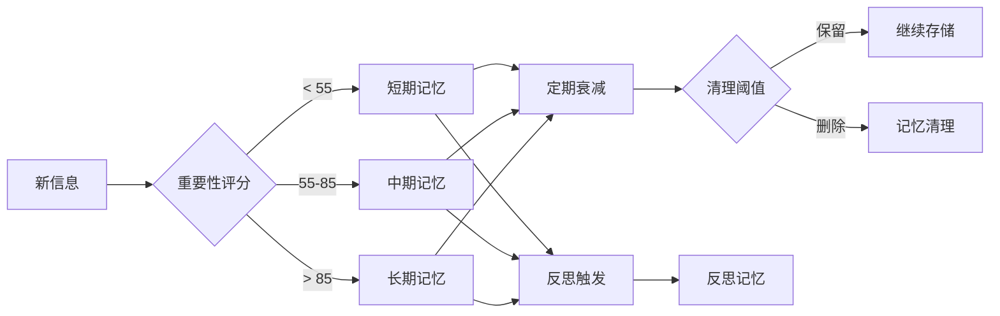

# 系统架构

INVESTOR-BENCH是一个基于LLM的智能投资回测系统，采用模块化设计，支持复杂的记忆系统和多种API集成。

## 整体架构



## 核心组件详解

### 1. MarketEnv (市场环境)

**职责**: 模拟真实市场环境，提供历史数据回放

**关键特性**:
- 时间序列数据管理
- 多资产同步处理
- 动量指标计算
- 未来价格差异计算(用于warmup训练)

**数据格式**:
```json
{
  "date": "2020-07-02",
  "price": {"JNJ": 126.30},
  "news": ["新闻1", "新闻2"],
  "momentum": {"JNJ": 0.05}
}
```

### 2. FinMemAgent (金融记忆代理)

**职责**: 核心智能决策代理，整合记忆系统和LLM推理

**核心流程**:
1. **信息接收** - 从MarketEnv接收当日信息
2. **记忆存储** - 将新信息向量化存储到记忆系统
3. **记忆检索** - 基于相似性检索相关历史记忆
4. **决策推理** - 使用LLM基于当前信息和历史记忆做决策
5. **行动执行** - 将决策转换为具体交易动作

**决策模式**:
- **Warmup模式**: 学习专业交易员建议，建立记忆库
- **Test模式**: 基于记忆做独立投资决策

### 3. 四层记忆系统

#### 短期记忆 (Short Memory)
- **时间范围**: 1-7天
- **衰减系数**: 3.0天
- **存储内容**: 日常新闻、价格变动、即时反应
- **重要性阈值**: 50.0

#### 中期记忆 (Mid Memory)  
- **时间范围**: 1周-3个月
- **衰减系数**: 90天
- **存储内容**: 趋势分析、季度报告、行业动态
- **重要性阈值**: 60.0

#### 长期记忆 (Long Memory)
- **时间范围**: 3个月以上
- **衰减系数**: 365天
- **存储内容**: 基本面分析、长期战略、历史教训
- **重要性阈值**: 90.0

#### 反思记忆 (Reflection Memory)
- **时间范围**: 持久存储
- **衰减系数**: 365天
- **存储内容**: 交易总结、策略反思、经验教训
- **相似性阈值**: 0.95



### 4. LLM服务集成

#### Chat API集成
- **支持模型**: GPT-4, Claude-3.5, Qwen3-8B等
- **结构化输出**: 使用Guardrails确保JSON格式
- **重试机制**: 自动重试和错误恢复
- **速率限制**: 配置化的请求间隔控制

#### Embedding API集成  
- **向量维度**: 支持1536, 2560, 3072等多种维度
- **批处理**: 支持批量文本向量化
- **缓存机制**: 避免重复计算相同文本
- **相似性计算**: 余弦相似度检索

### 5. Portfolio (投资组合管理)

**功能模块**:
- **交易执行**: buy/sell/hold动作执行
- **持仓管理**: 实时持仓和现金余额跟踪
- **收益计算**: 日收益、累计收益、夏普比率
- **风险控制**: 最大回撤、波动率监控
- **业绩归因**: 交易决策的详细记录和分析

**投资组合类型**:
- **单资产**: 单只股票的交易策略
- **多资产**: 多只股票的组合优化

## 配置系统

采用PKL (Pkl Configuration Language) 实现类型安全的配置管理:

```pkl
// 主配置结构
class MetaConfig {
    run_name: String
    trading_symbols: List<String>
    chat_model: String
    embedding_model: String
    // ... 更多配置项
}
```

**配置层级**:
1. **meta.pkl** - 元数据定义和类型约束
2. **chat_models.pkl** - LLM模型配置
3. **embedding.pkl** - Embedding模型配置  
4. **data.pkl** - 数据路径配置
5. **memory.pkl** - 记忆系统参数
6. **main.pkl** - 主配置入口

## 数据存储

### Qdrant向量数据库
- **集合管理**: 按资产和记忆类型分集合
- **向量存储**: 高维向量的高效存储和检索
- **元数据过滤**: 支持时间、重要性等多维过滤
- **相似性搜索**: 基于余弦相似度的快速检索

### 检查点系统
- **增量保存**: 只保存变化的状态
- **版本管理**: 多版本检查点支持回滚
- **压缩存储**: 使用pickle压缩存储复杂对象
- **恢复机制**: 异常中断后的自动恢复

## 扩展性设计

### 插件架构
- **Strategy插件**: 自定义交易策略
- **Data Provider插件**: 自定义数据源
- **LLM Provider插件**: 新的LLM服务商
- **Memory Plugin**: 自定义记忆存储方式

### API抽象层
所有外部服务通过抽象接口访问，便于替换和测试:
- `EmbeddingModel` - Embedding服务抽象
- `ChatModel` - 聊天模型抽象  
- `DataProvider` - 数据提供商抽象
- `MemoryStore` - 记忆存储抽象

### 性能优化
- **并行处理**: 多进程处理不同资产
- **缓存系统**: 多层缓存减少重复计算
- **批处理**: API调用的智能批处理
- **内存管理**: 大数据集的流式处理

这个架构设计确保了系统的高可用性、可扩展性和可维护性，同时保持了决策的准确性和一致性。