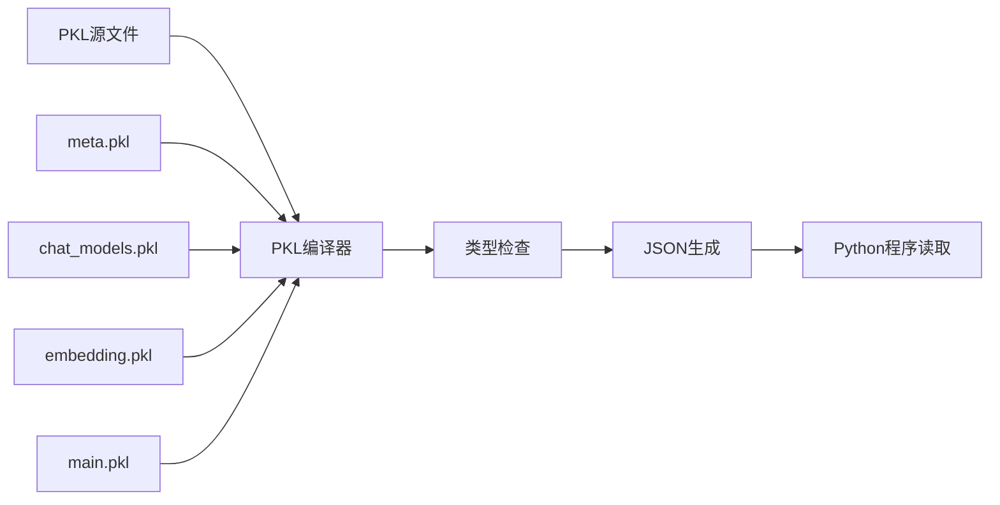

# 配置管理

INVESTOR-BENCH使用PKL配置语言实现类型安全的配置管理，本文档详细介绍配置系统的使用方法。

## 🏗️ 配置架构

### 配置文件层级

```
configs/
├── main.pkl              # 主配置入口
├── meta.pkl              # 类型定义和约束
├── chat_models.pkl       # LLM模型配置
├── embedding.pkl         # Embedding模型配置
├── data.pkl              # 数据路径配置
├── memory.pkl            # 记忆系统参数
├── character_string_catalog.pkl  # 角色设定
└── main.json             # 生成的JSON配置 (自动生成)
```

### 配置生成流程



## 📝 核心配置文件详解

### 1. main.pkl - 主配置

**用途**: 配置入口，组装所有配置模块

```pkl
import "meta.pkl"
import "data.pkl" 
import "memory.pkl"
import "chat_models.pkl"
import "embedding.pkl"
import "character_string_catalog.pkl"

// 主配置定义
hidden config = new meta.MetaConfig {
    run_name = "exp"                              // 实验名称
    agent_name = "agent"                          // 代理名称
    
    // 交易标的配置
    trading_symbols = new Listing {
        "JNJ"                                     // 强生公司
    }
    
    // 时间范围配置
    warmup_start_time = "2020-07-02"              // 学习开始时间
    warmup_end_time = "2020-07-10"                // 学习结束时间  
    test_start_time = "2020-10-01"                // 测试开始时间
    test_end_time = "2021-05-06"                  // 测试结束时间
    
    // 系统参数
    top_k = 5                                     // 记忆检索数量
    look_back_window_size = 3                     // 回看窗口大小
    momentum_window_size = 3                      // 动量窗口大小
    
    // 模型配置
    embedding_model = "qwen3-embedding-4b-siliconflow"
    chat_model = "qwen3-8b-siliconflow"
    
    // API参数
    chat_vllm_endpoint = "http://0.0.0.0:8000"   // VLLM端点 (可选)
    chat_parameters = new Mapping {
        ["temperature"] = 0.6                     // LLM温度参数
    }
}

// 生成各模块配置
chat_config = // ... 聊天配置组装逻辑
emb_config = // ... 嵌入配置组装逻辑  
env_config = // ... 环境配置组装逻辑
portfolio_config = // ... 组合配置组装逻辑
agent_config = // ... 代理配置组装逻辑
meta_config = // ... 元配置组装逻辑
```

### 2. meta.pkl - 类型定义

**用途**: 定义配置结构和类型约束

```pkl
import "chat_models.pkl"
import "character_string_catalog.pkl"

// 主配置类型定义
class MetaConfig {
    run_name: String                              // 实验名称
    agent_name: String                            // 代理名称
    
    // 交易标的 (必须在character_string_dict中存在)
    trading_symbols: Listing<String(character_string_catalog.character_string_dict.toMap().keys.contains(this))>
    
    // 时间配置 (ISO日期格式)
    warmup_start_time: String
    warmup_end_time: String
    test_start_time: String
    test_end_time: String
    
    // 数值参数 (带约束)
    top_k: Int(this >= 1)
    look_back_window_size: Int(this >= 1)
    momentum_window_size: Int(this >= 1)
    
    // 模型配置 (必须在预定义列表中)
    embedding_model: String(this is "text-embedding-3-large"|"text-embedding-3-small"|"text-embedding-ada-002"|"qwen3-embedding-4b-siliconflow")
    chat_model: String(chat_models.chat_model_dict.toMap().keys.contains(this))
    
    // 可选参数 (带默认值)
    embedding_timeout: Int(this >= 100) = 600
    chat_request_timeout: Int(this >= 1000) = 1000
    chat_max_new_token: Int(this >= 3) = 1000
    chat_vllm_endpoint: String | Null = null
    chat_parameters: Mapping
    
    // 记忆数据库配置
    memory_db_endpoint: String = "http://localhost:6333"
    memory_importance_upper_bound: Float(this > 0) = 100.0
    memory_importance_score_update_step: Float(this > 0) = 18.0
}
```

### 3. chat_models.pkl - LLM模型配置

**用途**: 定义所有支持的LLM模型

```pkl
// 模型配置基类
class ChatModelConfig {
    chat_model: String                            // 模型名称
    lora: Boolean = false                         // 是否使用LoRA
    lora_path: String| Null = null                // LoRA路径
    lora_base_model: String|Null = null           // LoRA基础模型
    chat_model_type: Null|String                  // 模型类型: "completion"|"instruction"|"chat"
    chat_model_inference_engine: String           // 推理引擎: "vllm"|"openai"|"anthropic"
    chat_system_message: Null|String = null      // 系统消息
    chat_endpoint: Null|String                    // API端点
    chat_template_path: Null|String               // 聊天模板路径
    chat_parameters: Mapping                      // 模型参数
    chat_request_sleep: Mapping|Null = null      // 请求控制
}

// SiliconFlow API配置示例
qwen3_8b_siliconflow: ChatModelConfig = new {
    chat_model = "Qwen/Qwen3-8B"
    chat_model_type = "chat"
    chat_model_inference_engine = "openai"
    chat_endpoint = "https://api.siliconflow.cn/v1/chat/completions"
    chat_template_path = null
    chat_system_message = "You are a helpful assistant."
    chat_parameters = new Mapping {
        ["temperature"] = 0.7
        ["max_tokens"] = 1024
    }
    chat_request_sleep = new Mapping {
        ["sleep_time"] = 2
        ["sleep_every_count"] = 10
    }
}

// 模型注册表
chat_model_dict = new Mapping {
    ["qwen3-8b-siliconflow"] = qwen3_8b_siliconflow
    ["gpt-4o"] = gpt_4o
    ["claude-sonnet-35"] = claude_sonnet_35
    // ... 更多模型
}
```

### 4. embedding.pkl - Embedding配置

```pkl
// Embedding配置基类
class EmbEndpointConfig {
    emb_model_name: String                        // 模型名称
    request_endpoint: String                      // API端点
    emb_size: Int(this > 0)                      // 向量维度
}

// SiliconFlow Embedding配置
qwen3_embedding_4b_siliconflow: EmbEndpointConfig = new {
    emb_model_name = "Qwen/Qwen3-Embedding-4B"
    request_endpoint = "https://api.siliconflow.cn/v1/embeddings"
    emb_size = 2560
}

// Embedding模型注册表
embedding_models = new Mapping {
    ["qwen3-embedding-4b-siliconflow"] = qwen3_embedding_4b_siliconflow
    ["text-embedding-3-large"] = text_embedding_3_large
    // ... 更多模型
}
```

## 🛠️ 配置操作指南

### 生成配置文件

```bash
# 基本生成
pkl eval -f json -o configs/main.json configs/main.pkl

# 验证语法
pkl eval configs/main.pkl > /dev/null

# 查看特定配置段
pkl eval -p chat_config configs/main.pkl
pkl eval -p emb_config configs/main.pkl
```

### 动态修改配置

```bash
# 修改模型配置
pkl eval -e 'configs/main.pkl.amend { 
    chat_model = "gpt-4o" 
}' -f json -o configs/main.json

# 修改交易标的
pkl eval -e 'configs/main.pkl.amend { 
    trading_symbols = new Listing { "AAPL", "GOOGL" } 
}' -f json -o configs/main.json

# 修改时间范围
pkl eval -e 'configs/main.pkl.amend { 
    test_start_time = "2021-01-01",
    test_end_time = "2021-12-31"
}' -f json -o configs/main.json
```

### 配置验证

```bash
# 类型检查
pkl eval -m configs/meta.pkl configs/main.pkl

# 约束检查
pkl eval configs/main.pkl | jq '.chat_config.chat_model'
pkl eval configs/main.pkl | jq '.env_config.trading_symbols'
```

## 🎯 常见配置场景

### 1. 添加新的LLM模型

**步骤1**: 在`chat_models.pkl`中添加模型配置
```pkl
your_model: ChatModelConfig = new {
    chat_model = "your-org/your-model"
    chat_model_type = "chat"
    chat_model_inference_engine = "openai"  // 或 "anthropic"
    chat_endpoint = "https://your-api-endpoint.com/v1/chat/completions"
    chat_system_message = "You are a helpful assistant."
    chat_parameters = new Mapping {
        ["temperature"] = 0.7
        ["max_tokens"] = 1024
    }
}
```

**步骤2**: 添加到模型注册表
```pkl
chat_model_dict = new Mapping {
    // ... 现有模型
    ["your-model"] = your_model
}
```

**步骤3**: 在主配置中使用
```pkl
chat_model = "your-model"
```

### 2. 配置多资产组合

```pkl
trading_symbols = new Listing {
    "AAPL"   // 苹果
    "GOOGL"  // 谷歌
    "MSFT"   // 微软
    "AMZN"   // 亚马逊
}
```

**注意**: 确保每个symbol都有对应的数据文件和角色设定。

### 3. 调整记忆系统参数

```pkl
// 在memory.pkl中修改
short_config = new {
    importance_init_val = 40.0        // 降低初始重要性
    decay_recency_factor = 2.0        // 更快衰减
    jump_upper_threshold = 60.0       // 提高晋升阈值
}
```

### 4. 优化API调用参数

```pkl
// 减少API调用频率
chat_request_sleep = new Mapping {
    ["sleep_time"] = 5                // 增加延迟
    ["sleep_every_count"] = 3         // 减少批次大小
}

// 调整LLM参数
chat_parameters = new Mapping {
    ["temperature"] = 0.3             // 降低随机性
    ["max_tokens"] = 512              // 减少token数量
    ["top_p"] = 0.8                   // 添加top-p采样
}
```

## 🔧 高级配置技巧

### 1. 条件配置

```pkl
// 根据环境选择配置
chat_endpoint = if (env.ENVIRONMENT == "production") 
    "https://api.production.com/v1/chat/completions"
else 
    "https://api.staging.com/v1/chat/completions"
```

### 2. 配置继承

```pkl
// 基础模型配置
base_openai: ChatModelConfig = new {
    chat_model_type = "chat"
    chat_model_inference_engine = "openai"
    chat_system_message = "You are a helpful assistant."
    chat_parameters = new Mapping {
        ["temperature"] = 0.7
    }
}

// 继承并扩展
gpt4_custom: ChatModelConfig = (base_openai) {
    chat_model = "gpt-4"
    chat_endpoint = "https://api.openai.com/v1/chat/completions"
    chat_parameters = (base_openai.chat_parameters) {
        ["max_tokens"] = 2048
    }
}
```

### 3. 配置模板

```pkl
// 创建配置模板函数
function createOpenAIConfig(model: String, endpoint: String) = new ChatModelConfig {
    chat_model = model
    chat_model_type = "chat" 
    chat_model_inference_engine = "openai"
    chat_endpoint = endpoint
    chat_system_message = "You are a helpful assistant."
    chat_parameters = new Mapping {
        ["temperature"] = 0.7
        ["max_tokens"] = 1024
    }
}

// 使用模板
gpt4o: ChatModelConfig = createOpenAIConfig("gpt-4o", "https://api.openai.com/v1/chat/completions")
```

## 🚨 配置最佳实践

### 1. 版本控制
- 所有PKL源文件纳入版本控制
- JSON文件可以忽略（自动生成）
- 使用有意义的配置文件名和注释

### 2. 环境分离
```pkl
// 开发环境
dev_config = new MetaConfig {
    run_name = "dev"
    warmup_end_time = "2020-07-10"    // 短期测试
    chat_parameters = new Mapping {
        ["temperature"] = 1.0         // 高随机性便于调试
    }
}

// 生产环境
prod_config = new MetaConfig {
    run_name = "prod"
    warmup_end_time = "2020-09-30"    // 完整训练
    chat_parameters = new Mapping {
        ["temperature"] = 0.6         // 稳定的输出
    }
}
```

### 3. 配置验证
- 使用类型约束防止配置错误
- 添加范围检查确保参数合理
- 定期验证配置文件的语法和逻辑

### 4. 文档化
- 为每个配置选项添加注释
- 维护配置变更日志
- 提供示例配置文件

这个配置系统为INVESTOR-BENCH提供了强大的灵活性，同时保证了类型安全和配置正确性。