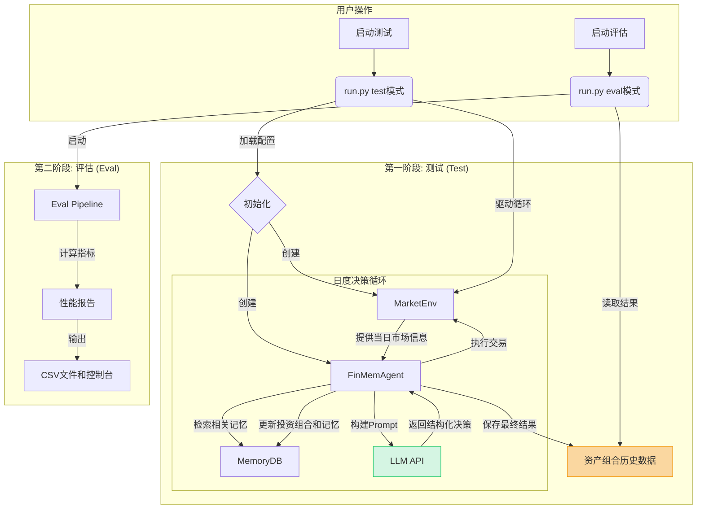

# Investor-Bench: 综合文档

欢迎来到 Investor-Benchs 的综合技术文档。本系列文档旨在为您提供一个关于此项目全面、深入的理解，使您能够在其基础上轻松地进行二次开发和实验。

## 1. 项目概览

`Investor-Bench` 是一个专为评估基于大型语言模型（LLM）的自主金融投资代理（Agent）而设计的基准测试框架。它的核心是模拟一个真实的金融市场环境，让一个由 LLM 驱动的代理在这个环境中进行连续的投资决策。

该框架具备以下关键特性：

- **事件驱动的模拟**: 系统以“天”为单位推进时间，在每个交易日向代理提供最新的市场信息（如股价、新闻等）。
- **复杂的代理架构**: 代理拥有一个复杂的多层记忆系统，能够进行长期规划和反思，不仅仅依赖于短期信息。
- **结构化的LLM交互**: 与LLM的通信是高度结构化和可控的，确保了决策的可靠性和可复现性。
- **全面的性能评估**: 框架提供了一套完整的评估流水线，用于计算代理投资策略的各项金融指标（如夏普比率、最大回撤等）。
- **模块化设计**: 项目的各个组件（环境、代理、记忆、评估）高度解耦，易于扩展和修改。

---

## 2. 核心工作流

整个 `Investor-Bench` 的工作流程可以分为两个主要阶段：**测试（Test）** 和 **评估（Eval）**。这两个阶段由主入口脚本 `run.py` 进行调度。

下面是整个工作流程的高层视图：



### 工作流详解:

1.  **启动测试 (`run.py test`)**: 用户通过命令行启动测试流程。
2.  **初始化**:
    - `run.py` 脚本加载 `configs/main.json` 配置文件。
    - 根据配置，它会实例化一个 `MarketEnv` 对象（市场环境）和一个 `FinMemAgent` 对象（投资代理）。
3.  **日度决策循环**:
    - 这是测试阶段的核心。`MarketEnv` 按天模拟时间流逝。
    - 在每一天，`MarketEnv` 将当天的所有市场信息（`OneDayMarketInfo`），包括股价、新闻、财报等，传递给 `FinMemAgent`。
    - `FinMemAgent` 接收到信息后，首先会查询其内部的 `MemoryDB`，寻找与当前市场状况相关的历史记忆。
    - 结合当前信息和检索到的记忆，代理构建一个复杂的提示（Prompt），并将其发送给预先配置好的大语言模型（LLM）。
    - LLM 对提示进行分析和推理，然后返回一个结构化的 JSON 对象，其中包含明确的投资决策（例如，对某支股票执行 `BUY`, `SELL`, 或 `HOLD`）以及做出该决策的理由。
    - `FinMemAgent` 解析这个决策，并更新其内部的 `Portfolio`（资产组合）状态。
    - 同时，代理会将今天的决策、理由以及市场信息作为新的记忆存入 `MemoryDB`。
    - 这个循环会一直持续到模拟的结束日期。
4.  **保存结果**:
    - 测试阶段完成后，代理的完整交易历史、每日的资产组合价值等信息将被序列化并保存到 `results/` 目录下的文件中。
5.  **启动评估 (`run.py eval`)**:
    - 用户启动评估流程。
    - `eval_pipeline.py` 中的函数被调用，它会读取 `results/` 目录下保存的测试结果。
6.  **计算与输出**:
    - 评估流水线会计算一系列标准的金融投资组合指标，包括累计回报、年化波动率、夏普比率和最大回撤。
    - 计算结果会以表格形式打印到控制台，并保存为 CSV 文件，以便进一步分析。

---

## 3. 关键数据结构与模块

为了更好地理解系统，以下是几个最核心的组件和数据结构的简介。更详细的介绍请参见 `docs/modules/` 目录下的分文档。

-   **`MarketEnv` (环境)**: 模拟市场的核心类。它负责加载历史数据，并按时间步（天）向代理提供 `OneDayMarketInfo` 对象。
-   **`OneDayMarketInfo` (数据结构)**: 这是一个 Pydantic 模型，用于封装在**单个交易日**内环境提供给代理的所有信息。它就像代理每天早上收到的“市场简报”，包含了日期、价格、新闻、财报、动量指标等所有决策所需的数据。
-   **`FinMemAgent` (代理)**: 整个系统的“大脑”。它接收环境信息，管理自己的记忆，与LLM交互，并做出最终决策。
-   **`MemoryDB` (记忆)**: 代理的记忆中枢，基于 `Qdrant` 向量数据库实现。它不仅仅是一个简单的信息存储，而是一个复杂的多层记忆系统，分为**短期记忆、中期记忆、长期记忆和反思记忆**。这种设计模仿了人类的记忆机制，使得代理能够进行更深层次的思考。
-   **`Portfolio` (投资组合)**: 记录代理的资产状态，包括持有的现金、股票数量以及每日的交易历史和总价值。
-   **LLM 交互模块 (位于 `src/chat/`)**:
    - **Prompt (`src/chat/prompt/`)**: 负责根据当前情况动态构建发送给 LLM 的复杂提示。
    - **Endpoint (`src/chat/endpoint/`)**: 负责与不同的大模型API（如 OpenAI、vLLM）进行通信。
    - **Structure Generation (`src/chat/structure_generation/`)**: 负责定义并强制 LLM 输出的必须遵循的 JSON Schema，确保返回结果的可靠性。
-   **`EvalPipeline` (评估)**: 一组用于事后分析的函数，负责计算并展示代理的投资表现。

---

## 4. 如何开始

请遵循以下步骤，在您自己的环境中运行一次完整的测试-评估流程：

1.  **环境设置**:
    - 创建并激活一个 Python 虚拟环境。
    - 安装所有依赖: `pip install -r requirements.txt`

2.  **配置API**:
    - 在项目根目录下创建一个 `.env` 文件。
    - 根据您选择的LLM服务商，在文件中配置API密钥和端点。例如，使用 OpenAI：
      ```env
      OPENAI_API_KEY="sk-your-key-here"
      ```
    - 如果您使用兼容OpenAI接口的本地模型或第三方服务，还需指定 `OPENAI_API_BASE`。

3.  **修改配置文件 (`configs/main.json`)**:
    - **`agent_name`**: 为您的本次实验命名。
    - **`trading_symbols`**: 定义要交易的股票代码（例如 `["MSFT"]`）。
    - **`test_start_time` / `test_end_time`**: 设置回测的起止日期。
    - **`llm_model_name`**: 指定您要使用的具体模型名称（例如 `"gpt-4-turbo"`）。

4.  **运行测试**:
    ```bash
    python run.py test -c configs/main.json
    ```
    您将看到一个进度条，显示模拟交易的进行过程。日志会保存在 `logs/` 目录下。

5.  **运行评估**:
    ```bash
    python run.py eval -c configs/main.json
    ```
    测试完成后，运行此命令。您将在控制台看到最终的性能指标总结，同时结果会保存到 `results/metrics/` 目录下的CSV文件中。

## 5. 下一步

我们强烈建议您接下来阅读 `docs/modules/` 目录下的分模块文档，以深入了解每个组件的具体实现细节。这对于您进行二次开发至关重要。 