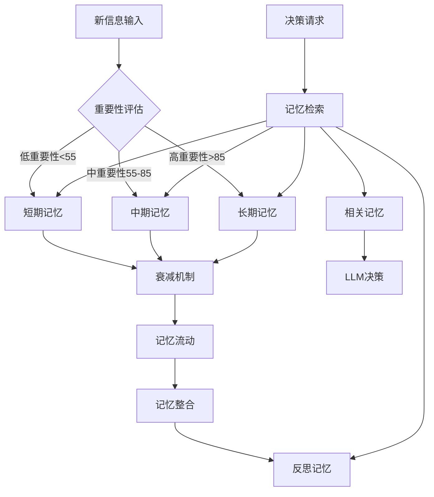
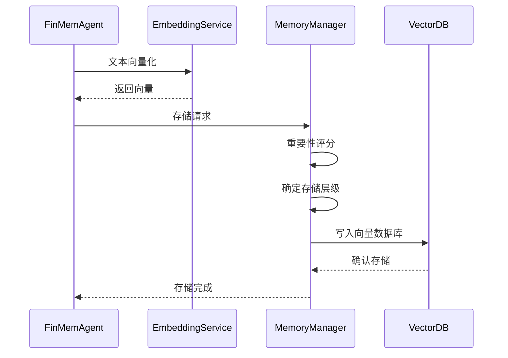

# 记忆系统设计

INVESTOR-BENCH的核心创新是四层分级记忆系统，模拟人类投资专家的认知记忆模式，实现长期投资知识的积累和应用。

## 🧠 记忆系统概览

### 设计理念

基于认知科学和行为金融学原理，模拟专业投资者的记忆结构：

1. **短期记忆** - 即时反应和日常信息
2. **中期记忆** - 趋势分析和周期性规律  
3. **长期记忆** - 基本面知识和历史经验
4. **反思记忆** - 投资哲学和策略原则



## 📚 四层记忆详解

### 1. 短期记忆 (Short Memory)

**时间范围**: 1-7天  
**存储容量**: 无限制，但快速衰减  
**主要内容**: 
- 每日新闻和市场动态
- 短期价格波动
- 即时情绪反应
- 日内交易信号

#### 配置参数
```json
{
  "db_name": "short",
  "importance_init_val": 50.0,        // 初始重要性分数
  "decay_recency_factor": 3.0,        // 3天衰减周期
  "decay_importance_factor": 0.92,    // 每天衰减8%
  "clean_up_recency_threshold": 0.05, // 清理阈值
  "clean_up_importance_threshold": 5.0,
  "jump_upper_threshold": 55.0        // 晋升到中期记忆阈值
}
```

#### 衰减计算公式
```python
# 新近性衰减
recency_score = exp(-days_elapsed / decay_recency_factor)

# 重要性衰减  
importance_score = initial_importance * (decay_importance_factor ** days_elapsed)

# 综合分数
final_score = importance_score * recency_score
```

#### 典型存储内容示例
```json
{
  "memory_id": 1,
  "content": "苹果公司发布新iPhone，股价盘前上涨2.5%",
  "date": "2023-09-15",
  "importance": 52.0,
  "symbol": "AAPL",
  "sentiment": "positive",
  "vector": [0.123, -0.456, ...],
  "metadata": {
    "source": "news",
    "category": "product_launch"
  }
}
```

### 2. 中期记忆 (Mid Memory)

**时间范围**: 1周-3个月  
**存储策略**: 从短期记忆晋升或直接存储  
**主要内容**:
- 季度财报分析
- 行业趋势变化  
- 宏观经济数据
- 中期技术形态

#### 配置参数
```json
{
  "db_name": "mid", 
  "importance_init_val": 60.0,
  "decay_recency_factor": 90.0,       // 90天衰减周期
  "decay_importance_factor": 0.96,    // 每天衰减4%
  "jump_lower_threshold": 55.0,       // 从短期记忆接收阈值
  "jump_upper_threshold": 85.0        // 晋升到长期记忆阈值
}
```

#### 记忆流动机制
```python
def memory_flow_check(memory):
    if memory.importance_score > jump_upper_threshold:
        # 晋升到长期记忆
        move_to_long_memory(memory)
    elif memory.importance_score < jump_lower_threshold:
        # 降级到短期记忆或清理
        if memory.recency_score > 0.1:
            move_to_short_memory(memory)
        else:
            delete_memory(memory)
```

### 3. 长期记忆 (Long Memory)

**时间范围**: 3个月以上，持久存储  
**存储策略**: 高重要性信息的长期保存  
**主要内容**:
- 公司基本面分析
- 长期投资理念
- 历史重大事件
- 经济周期规律

#### 配置参数
```json
{
  "db_name": "long",
  "importance_init_val": 90.0,
  "decay_recency_factor": 365.0,      // 365天衰减周期  
  "decay_importance_factor": 0.96,    // 极慢衰减
  "jump_lower_threshold": 85.0,       // 接收阈值
  "clean_up_importance_threshold": 20.0 // 更高的清理阈值
}
```

#### 长期记忆特点
- **持久性**: 衰减极慢，可保存数年
- **稳定性**: 不易被短期波动影响
- **权威性**: 在决策中具有更高权重
- **概括性**: 存储抽象的投资原则和规律

### 4. 反思记忆 (Reflection Memory)

**独特功能**: 存储元认知和投资哲学  
**触发机制**: 定期反思或重大决策后  
**主要内容**:
- 投资决策总结
- 成功/失败经验
- 策略调整思考
- 投资哲学进化

#### 配置参数
```json
{
  "db_name": "reflection",
  "importance_init_val": 80.0,
  "decay_recency_factor": 365.0,
  "decay_importance_factor": 0.98,    // 最慢衰减
  "similarity_threshold": 0.95        // 高相似度去重
}
```

#### 反思触发条件
```python
def should_trigger_reflection(agent_state):
    conditions = [
        agent_state.days_since_last_reflection > 30,  # 30天未反思
        agent_state.recent_loss > 0.05,               # 最近损失>5%
        agent_state.strategy_change_detected,         # 检测到策略变化
        agent_state.market_regime_change              # 市场环境变化
    ]
    return any(conditions)
```

## 🔄 记忆操作机制

### 1. 记忆存储流程



#### 重要性评分算法
```python
def calculate_importance(content, context):
    factors = {
        'market_impact': assess_market_impact(content),      # 0-30分
        'information_novelty': assess_novelty(content),      # 0-25分  
        'relevance_to_holdings': assess_relevance(content),  # 0-20分
        'source_credibility': assess_source(content),        # 0-15分
        'temporal_urgency': assess_urgency(content)          # 0-10分
    }
    
    weighted_score = sum(score * weight for score, weight in factors.items())
    return min(weighted_score, 100.0)  # 最高100分
```

### 2. 记忆检索流程

```python
def retrieve_relevant_memories(query, top_k=5):
    # 1. 向量化查询
    query_vector = embedding_service.embed(query)
    
    # 2. 多层级检索
    memories = {}
    for memory_type in ['short', 'mid', 'long', 'reflection']:
        results = qdrant_client.search(
            collection_name=f"{symbol}_{memory_type}",
            query_vector=query_vector,
            limit=top_k,
            score_threshold=0.7
        )
        memories[memory_type] = results
    
    # 3. 重要性加权排序
    all_memories = []
    for mem_type, mems in memories.items():
        for mem in mems:
            weighted_score = mem.score * memory_weights[mem_type]
            all_memories.append((weighted_score, mem))
    
    # 4. 返回最相关的记忆
    return sorted(all_memories, reverse=True)[:top_k]
```

### 3. 记忆维护机制

#### 定期清理任务
```python
def memory_maintenance():
    for collection in memory_collections:
        # 1. 清理过期记忆
        expired_memories = find_expired_memories(collection)
        delete_memories(expired_memories)
        
        # 2. 记忆流动检查
        promote_memories = find_promotion_candidates(collection)
        for memory in promote_memories:
            move_to_higher_level(memory)
        
        # 3. 去重处理
        duplicates = find_duplicate_memories(collection)
        merge_or_delete_duplicates(duplicates)
        
        # 4. 重新计算重要性分数
        update_importance_scores(collection)
```

#### 记忆压缩和归档
```python  
def memory_compression():
    # 将相似的短期记忆合并为中期记忆
    similar_groups = cluster_similar_memories('short')
    for group in similar_groups:
        if len(group) > 3:  # 3个以上相似记忆
            compressed_memory = create_summary_memory(group)
            store_in_mid_memory(compressed_memory)
            delete_original_memories(group)
```

## 📊 记忆系统性能

### 存储容量规划

| 记忆层级 | 平均记忆数 | 生命周期 | 存储大小 |
|---------|-----------|----------|----------|
| 短期记忆 | 100-500   | 1-7天    | 10-50MB  |
| 中期记忆 | 200-800   | 1周-3月  | 20-80MB  |
| 长期记忆 | 500-2000  | 3月-数年  | 50-200MB |
| 反思记忆 | 50-200    | 持久     | 5-20MB   |

### 检索性能优化

#### 向量索引优化
```python
# Qdrant集合配置
collection_config = {
    "vectors": {
        "size": 2560,  # 向量维度
        "distance": "Cosine"  # 余弦相似度
    },
    "optimizers_config": {
        "default_segment_number": 2,
        "max_segment_size": 20000,
        "memmap_threshold": 50000
    },
    "hnsw_config": {
        "m": 16,         # 连接数
        "ef_construct": 100,  # 构建时搜索参数
        "full_scan_threshold": 10000
    }
}
```

#### 缓存策略
```python
from functools import lru_cache

@lru_cache(maxsize=1000)
def cached_memory_search(query_hash, memory_type):
    """缓存常见查询结果"""
    return perform_vector_search(query_hash, memory_type)
```

## 🎯 记忆系统实战应用

### 决策中的记忆运用

#### 1. 多层记忆融合决策
```python
def make_investment_decision(current_info):
    # 检索各层记忆
    short_memories = retrieve_memories(current_info, 'short', top_k=3)
    mid_memories = retrieve_memories(current_info, 'mid', top_k=2) 
    long_memories = retrieve_memories(current_info, 'long', top_k=2)
    reflection_memories = retrieve_memories(current_info, 'reflection', top_k=1)
    
    # 构建决策上下文
    context = {
        'current': current_info,
        'recent_trends': short_memories,
        'industry_analysis': mid_memories, 
        'fundamental_knowledge': long_memories,
        'investment_philosophy': reflection_memories
    }
    
    # LLM决策
    return llm_decision(context)
```

#### 2. 记忆一致性检查
```python
def check_memory_consistency(new_decision, historical_memories):
    """检查新决策与历史记忆的一致性"""
    
    consistency_scores = []
    for memory in historical_memories:
        similarity = calculate_semantic_similarity(new_decision, memory.content)
        sentiment_alignment = compare_sentiment(new_decision, memory)
        
        consistency = (similarity * 0.7 + sentiment_alignment * 0.3)
        consistency_scores.append(consistency)
    
    avg_consistency = sum(consistency_scores) / len(consistency_scores)
    
    if avg_consistency < 0.3:
        # 决策与历史记忆不一致，需要特别关注
        trigger_reflection("Decision inconsistency detected")
    
    return avg_consistency
```

### 记忆系统监控

#### 关键指标监控
```python
def memory_system_health_check():
    metrics = {
        'total_memories': count_all_memories(),
        'memory_distribution': get_memory_distribution(),
        'average_importance': calculate_avg_importance(),
        'retrieval_latency': measure_retrieval_speed(),
        'storage_utilization': get_storage_usage(),
        'memory_flow_rate': calculate_promotion_rate()
    }
    
    # 异常检测
    if metrics['retrieval_latency'] > 1000:  # 超过1秒
        optimize_vector_index()
        
    if metrics['storage_utilization'] > 0.8:  # 超过80%
        trigger_memory_cleanup()
    
    return metrics
```

这个记忆系统设计使INVESTOR-BENCH能够像人类专家一样积累和运用投资知识，实现真正的智能化投资决策。