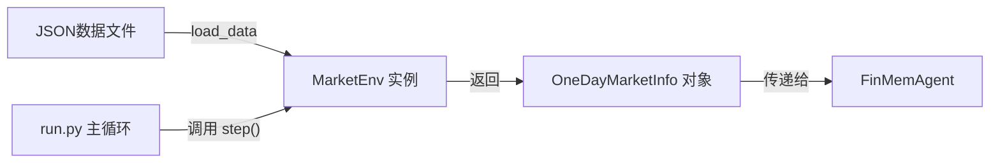

# 模块详解: 市场环境 (Environment)

**文件路径**: `src/market_env.py`

本篇文档详细剖析 `Investor-Bench` 的核心组件之一：**市场环境**。环境模块是整个模拟的基础，它负责驱动时间的进行，并为代理（Agent）提供做出决策所需的一切外部信息。

## 1. 核心设计思想

`MarketEnv` 的设计遵循了强化学习中经典的环境（Environment）概念。它的核心职责可以概括为：

- **模拟时间**: 作为一个离散时间步长的模拟器，它将时间以“交易日”为单位向前推进。
- **提供观测 (Observation)**: 在每个时间步，它会生成一个包含当前市场所有相关信息的“观测”数据包，并将其发送给代理。
- **状态管理**: 它内部维护着模拟的当前状态，例如当前日期、历史价格序列等。

这个模块最关键的设计决策是**将环境与代理完全解耦**。环境不知道也不关心代理的内部逻辑；它只负责在正确的时间提供正确的数据。这种设计使得更换或修改代理变得非常容易，而无需触及环境的代码。

---

## 2. 关键类与数据结构

### 2.1 `MarketEnv` 类

这是环境模块的实现主体。让我们深入了解它的工作机制。

#### 初始化 `__init__`

```python
# src/market_env.py

class MarketEnv:
    def __init__(
        self,
        env_data_path: dict,
        start_date: str,
        end_date: str,
        symbol: str,
        momentum_window_size: int,
    ):
        # ...
        self.env_data = self.load_data(self.env_data_path)
        # ...
        self.final_date_series = sorted(intersection_dates) if intersection_dates else []
        self.simulation_length = len(self.final_date_series)
```

- **输入参数**:
    - `env_data_path`: 一个字典，键是股票代码（如 "MSFT"），值是包含该股票所有历史数据的 JSON 文件路径。
    - `start_date` / `end_date`: 定义了本次模拟回测的时间范围。
    - `symbol`: 要交易的股票代码列表。
    - `momentum_window_size`: 用于计算动量指标的时间窗口大小。
- **核心逻辑**:
    1.  **加载数据 (`load_data`)**: 它会遍历 `env_data_path` 字典，读取所有指定股票的 JSON 数据文件，并将这些数据加载到内存中的 `self.env_data` 字典里。
    2.  **构建日期序列**: 它是如何确定模拟要运行哪些天呢？
        - 它会分别获取每只股票在指定时间范围内的所有交易日。
        - 然后，它会取这些日期集合的**交集**，生成一个 `self.final_date_series` 列表。这意味着，模拟只会在**所有**指定股票当天都有数据的情况下进行，这确保了数据的一致性。
    3.  **计算模拟长度**: `self.simulation_length` 被设置为最终日期序列的长度，用于显示进度条。

#### 核心方法: `step()`

`step()` 是 `MarketEnv` 最重要的方法。每当 `run.py` 中的主循环迭代一次，就会调用一次 `step()`，其作用是**将模拟向前推进一天，并返回当天的市场信息**。

```python
# src/market_env.py

def step(self) -> OneDayMarketInfo:
    try:
        cur_date = self.final_date_series.pop(0)
        future_date = self.final_date_series[0]
        # ...
    except IndexError:
        # 如果日期序列为空，表示模拟结束
        return OneDayMarketInfo(..., termination_flag=True)

    # ... 准备当天的数据 ...
    
    for symbol in self.env_data.keys():
        # 从 self.env_data 中提取价格、新闻等信息
        price = self.env_data[symbol][cur_date_str]["prices"]
        cur_news = self.env_data[symbol][cur_date_str]["news"]
        
        # 计算未来价格差异 (用于WARMUP模式下的监督学习)
        future_price = self.env_data[symbol][future_date_str]["prices"]
        cur_future_price_diff = float((price - future_price) / price)
        
        # 计算动量
        cur_momentum = self.get_momentum(symbol)
        
        # ... 将所有信息打包 ...

    return OneDayMarketInfo(...)
```

- **核心逻辑**:
    1.  **日期推进**: 它从 `self.final_date_series` 列表的开头弹出一个日期作为 `cur_date`（当前日期），并查看下一个日期作为 `future_date`。
    2.  **终止条件**: 如果列表为空，说明所有日期都已处理完毕，模拟结束。它会返回一个特殊的 `OneDayMarketInfo` 对象，其 `termination_flag` 被设为 `True`。
    3.  **信息收集**:
        - 对于 `cur_date`，它会遍历每只股票，从 `self.env_data` 中提取当天的价格、新闻、财报（10-K, 10-Q）等信息。
        - 它还会调用 `get_momentum()` 方法，根据过去一段时间的价格历史计算动量指标。
        - **一个重要的细节**: 它还会计算 `cur_future_price_diff`，即当前价格与**下一天**价格的差异。这个信息在 `WARMUP` 模式下被用作一个“作弊”信号，来对代理进行有监督的预热训练，但在真正的 `TEST` 模式下，代理是看不到这个未来信息的。
    4.  **打包返回**: 所有收集到的信息都被封装进一个 `OneDayMarketInfo` 对象并返回给调用者（即 `FinMemAgent`）。

### 2.2 `OneDayMarketInfo` 数据类

**文件路径**: `src/market_env.py`

这个类是环境与代理之间信息传递的“标准信封”。它是一个 `Pydantic` 模型，确保了数据类型的正确性和一致性。

```python
# src/market_env.py

class OneDayMarketInfo(BaseModel):
    cur_date: Union[date, None]
    cur_price: Union[Dict[str, float], None]
    cur_news: Union[Dict[str, Union[List[str], None]], None]
    cur_filing_k: Union[Dict[str, Union[str, None]], None]
    cur_filing_q: Union[Dict[str, Union[str, None]], None]
    cur_future_price_diff: Union[Dict[str, Union[float, None]], None]
    cur_momentum: Union[Dict[str, Union[int, None]], None]
    cur_symbol: Union[List[str], None]
    termination_flag: bool
```

- **字段解析**:
    - `cur_date`: 当前的交易日期。
    - `cur_price`: 一个字典，包含了每只股票的当日价格。
    - `cur_news`: 一个字典，包含了每只股票的当日新闻列表。
    - `cur_filing_k`/`cur_filing_q`: 当日发布的10-K（年报）或10-Q（季报）信息。
    - `cur_future_price_diff`: （仅供Warmup模式使用）价格与下一日的差异。
    - `cur_momentum`: 每只股票的动量指标（1表示上升，-1表示下降，0表示持平）。
    - `cur_symbol`: 当天涉及的股票代码列表。
    - `termination_flag`: 一个布尔值，如果为 `True`，则表示模拟结束。

代理在它的 `step` 方法中接收这个对象，并基于其中的信息来做出决策。

---

## 3. 数据流

环境模块的数据流是单向且清晰的：



---

## 4. 二次开发指引

如果您希望基于此模块进行二次开发，以下是一些可能的方向：

- **添加新的数据源**:
    - 假设您想引入宏观经济指标（如利率）。
    1.  首先，您需要修改数据预处理脚本（未在本项目代码中，但为项目前提），将新指标加入到 `data/*.json` 文件中。
    2.  在 `OneDayMarketInfo` 类中增加一个新的字段，例如 `macro_indicator: Union[Dict, None]`。
    3.  在 `MarketEnv.step()` 方法中，增加从 `self.env_data` 提取这个新指标的逻辑，并将其填充到返回的 `OneDayMarketInfo` 对象中。
- **修改时间逻辑**:
    - 如果您想从日频模拟改为周频，您需要修改 `MarketEnv.__init__` 中构建 `self.final_date_series` 的逻辑，使其只保留每周的最后一个交易日。
- **引入随机性**:
    - 当前环境是完全确定性的。如果您想模拟市场的随机波动，可以在 `MarketEnv.step()` 中为价格等信息增加一个小的随机噪声。

总而言之，`MarketEnv` 是一个设计良好、易于扩展的组件。只要您保证它在每个 `step` 调用中都能返回一个格式正确的 `OneDayMarketInfo` 对象，您就可以自由地修改其内部实现，以满足您自己的研究需求。 