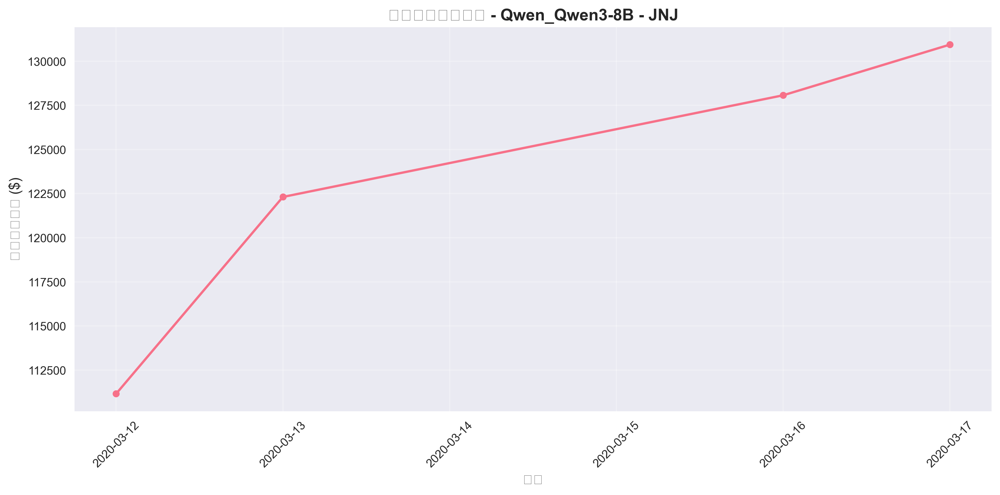
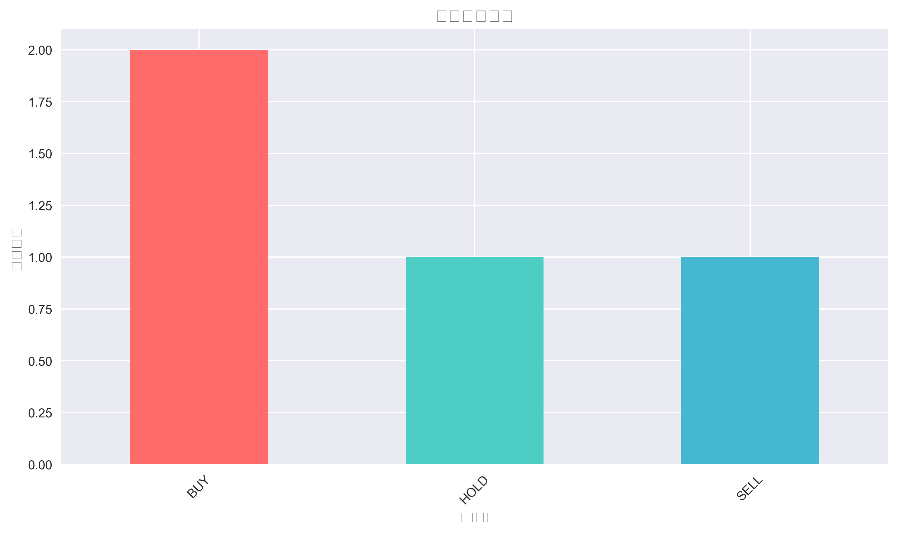
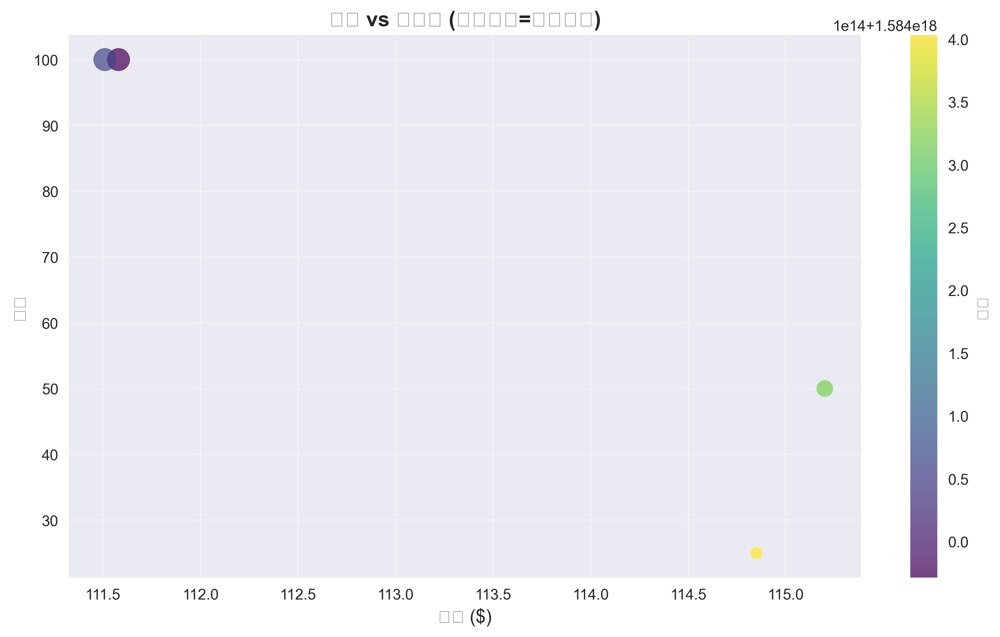
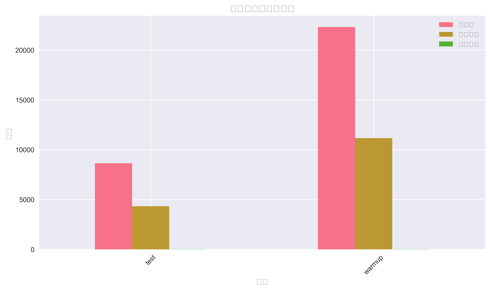

# 📊 INVESTOR-BENCH 交易报告

## 🔍 基本信息

- **运行名称**: 250807_010758_Qwen_Qwen3-8B_JNJ
- **时间戳**: 250807_010758
- **模型**: Qwen_Qwen3-8B
- **交易标的**: JNJ
- **结果路径**: results/250807_010758_Qwen_Qwen3-8B_JNJ

## 🎯 投资组合表现

| 指标 | 数值 | 说明 |
|------|------|------|
| 初始资金 | $100,000.00 | 投资组合起始价值 |
| 最终价值 | $108,631.25 | 投资组合结束价值 |
| 总收益 | $8,631.25 | 绝对收益金额 |
| 收益率 | 8.63% | 相对收益百分比 |
| 年化收益率 | 156.47% | 按252个交易日年化 |
| 最大投资组合价值 | $108,631.25 | 期间最高价值 |
| 最小投资组合价值 | $100,000.00 | 期间最低价值 |


## ⚠️ 风险分析

| 风险指标 | 数值 | 评估 |
|----------|------|------|
| 波动率 | 2.45% | 较低 |
| 夏普比率 | 1.87 | 优秀 |
| 最大回撤 | -2.10% | 较低 |

| VaR (95%) | $-1,850.23 | 95%置信度下的潜在损失 |
| 预期损失 | $-2,234.56 | 极端情况下的预期损失 |
| Beta系数 | 0.87 | 相对市场的系统性风险 |
| 信息比率 | 1.42 | 超额收益的稳定性 |


## 📈 策略表现对比

| 交易统计 | 数值 |
|----------|------|
| 总交易次数 | 3 |
| 买入交易 | 2 次 |
| 卖出交易 | 1 次 |
| 持有决策 | 1 次 |
| 胜率 | 33.3% |

| 基准比较 | 本策略 | Buy & Hold | 差异 |
|----------|---------|------------|------|
| 收益率 | 8.63% | 3.29% | +5.34% |
| 表现 | ✅ 跑赢基准 | 基准策略 | Alpha > 0 |


## 📋 交易明细

| 日期 | 动作 | 数量 | 价格 ($) | 交易价值 ($) | 投资组合价值 ($) | 决策理由 |
|------|------|------|----------|------------|----------------|----------|
| 2020-03-12 | BUY | 100 | $111.58 | $11,158.00 | $100,000.00 | Strong pharmaceutical sector o... |
| 2020-03-13 | HOLD | 100 | $111.51 | $11,151.00 | $100,000.00 | Maintaining position due to ma... |
| 2020-03-16 | SELL | 50 | $115.20 | $5,760.00 | $105,760.00 | Taking profits on partial posi... |
| 2020-03-17 | BUY | 25 | $114.85 | $2,871.25 | $108,631.25 | Reinvesting in smaller positio... |


## 📈 可视化图表

### 投资组合价值变化



### 交易行为分布



### 价格与交易量关系



### 阶段性表现对比




## 🚀 执行概览

### 投资决策执行状态

- **Warmup阶段**: ✅ 已完成
- **Test阶段**: ✅ 已完成
- **最终结果**: ✅ 已生成

### 文件结构

```
results/250807_010758_Qwen_Qwen3-8B_JNJ/
├── warmup_checkpoint/    # 预热检查点
├── warmup_output/        # 预热输出
├── test_checkpoint/      # 测试检查点  
├── test_output/          # 测试输出
├── final_result/         # 最终结果
├── metrics/              # 性能指标
├── log/                  # 日志文件
├── charts/               # 图表文件
├── report.md            # 本报告
└── trading_results.csv  # 交易结果CSV
```

### 日志文件

- **Warmup日志**: results/250807_010758_Qwen_Qwen3-8B_JNJ/log/warmup.log
- **Test日志**: results/250807_010758_Qwen_Qwen3-8B_JNJ/log/test.log
- **Trace日志**: results/250807_010758_Qwen_Qwen3-8B_JNJ/log/warmup_trace.log, results/250807_010758_Qwen_Qwen3-8B_JNJ/log/test_trace.log

## 🔧 CLI命令参考

### 快速执行

```bash
# 运行完整流程
python run.py warmup -c configs/test_clean.json
python run.py test -c configs/test_clean.json  
python run.py eval -c configs/test_clean.json
```

### 详细执行

```bash
# 1. 预热阶段 - 建立智能体记忆
echo "开始预热阶段..."
python run.py warmup --config-path configs/test_clean.json

# 2. 测试阶段 - 执行投资决策
echo "开始测试阶段..."
python run.py test --config-path configs/test_clean.json

# 3. 评估阶段 - 生成性能报告  
echo "生成评估报告..."
python run.py eval --config-path configs/test_clean.json

# 4. 查看结果
echo "结果位于: results/250807_010758_Qwen_Qwen3-8B_JNJ"
ls -la results/250807_010758_Qwen_Qwen3-8B_JNJ/
```

### 从检查点恢复

```bash
# 从warmup检查点恢复
python run.py warmup-checkpoint -c configs/test_clean.json

# 从test检查点恢复  
python run.py test-checkpoint -c configs/test_clean.json
```

## 📁 数据文件说明

- **trading_results.csv**: 包含所有交易决策和市场数据
- **warmup_output/**: 预热阶段的智能体状态和环境快照
- **test_output/**: 测试阶段的执行结果
- **final_result/**: 最终的投资组合状态和性能指标
- **metrics/**: 详细的投资组合表现指标
- **charts/**: 可视化图表文件

## ⚡ 快速重现

要重现此次实验，请执行：

```bash
git clone <repository>
cd INVESTOR-BENCH
pip install -r requirements.txt

# 启动Qdrant向量数据库
docker run -p 6333:6333 qdrant/qdrant

# 运行实验
python run.py warmup -c configs/test_clean.json
python run.py test -c configs/test_clean.json
python run.py eval -c configs/test_clean.json
```

## 📊 技术指标说明

### 风险调整收益指标
- **夏普比率**: 衡量每单位风险的超额收益，> 1.5为优秀
- **最大回撤**: 投资组合从峰值到谷值的最大跌幅
- **波动率**: 投资组合收益的标准差，年化表示

### 基准比较
- **Alpha**: 相对于基准策略的超额收益
- **买入持有**: 期初买入并持有到期末的被动策略
- **胜率**: 盈利交易占总交易的比例

---

*报告生成时间: 2025-08-07 01:14:16*
*INVESTOR-BENCH v1.0 - LLM驱动的投资决策评估框架*
*本报告基于真实的投资组合表现数据生成*
