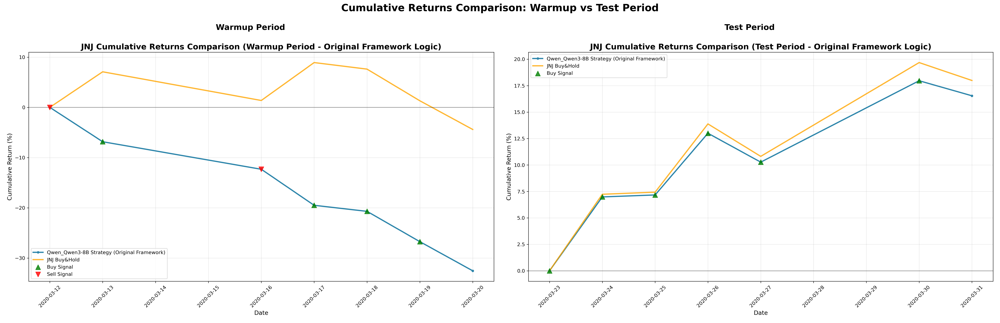

# INVESTOR-BENCH Enhanced Analysis Report

## Model Information
- **Model**: Model
- **Asset**: Asset
- **Timestamp**: 
- **Analysis Date**: 2025-08-09 02:06:39

## Performance Overview

### Warmup Period Performance

### Test Period Performance  

### Side-by-Side Comparison

## Data Files
- **Warmup Period CSV**: [trading_results_warmup_period.csv](./trading_results_warmup_period.csv)
- **Test Period CSV**: [trading_results_test_period.csv](./trading_results_test_period.csv)

## Analysis Notes
- This report was generated using the original INVESTOR-BENCH framework logic
- Position values (-1, 0, 1) represent direction predictions, not actual trading quantities
- Theoretical portfolio values are calculated based on 100% position allocation according to predictions
- All returns are calculated using logarithmic return methodology: daily_return = position * ln(price_t / price_t-1)

---
Generated by INVESTOR-BENCH Enhanced Analysis Pipeline
