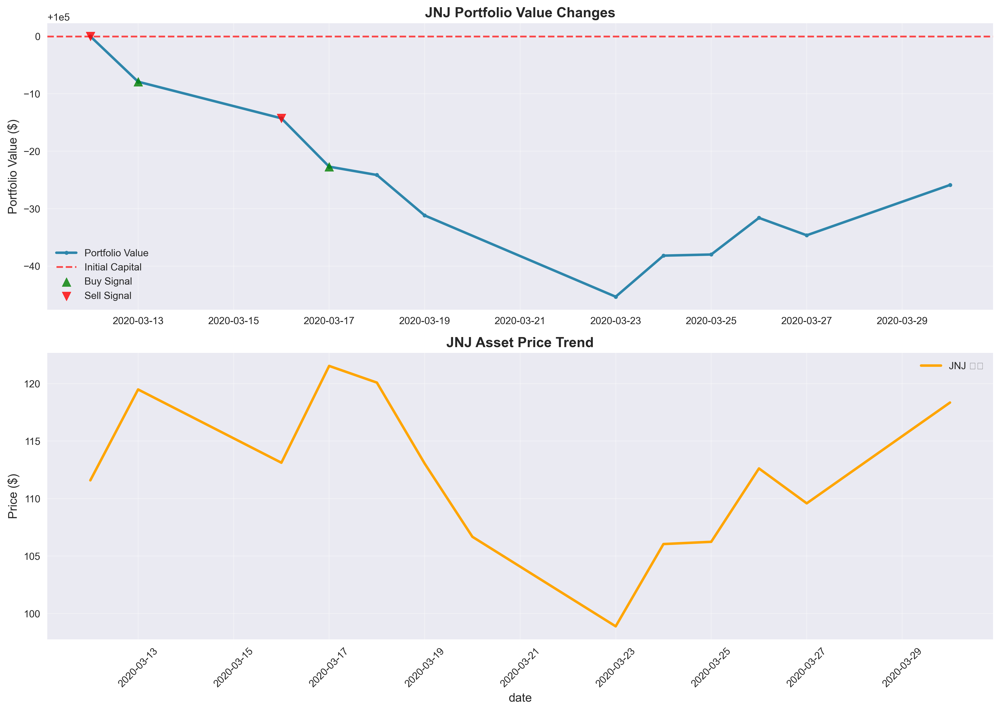
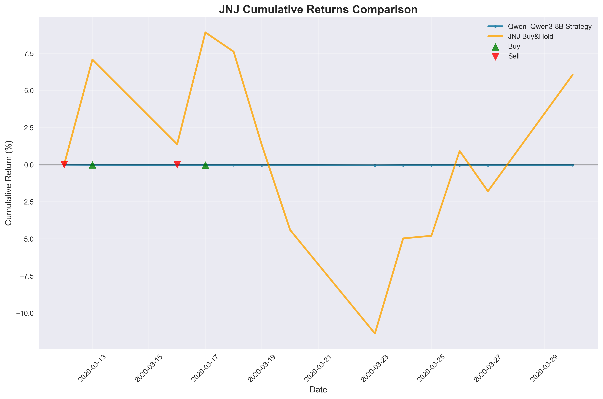
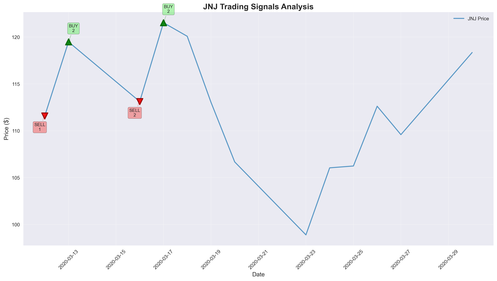
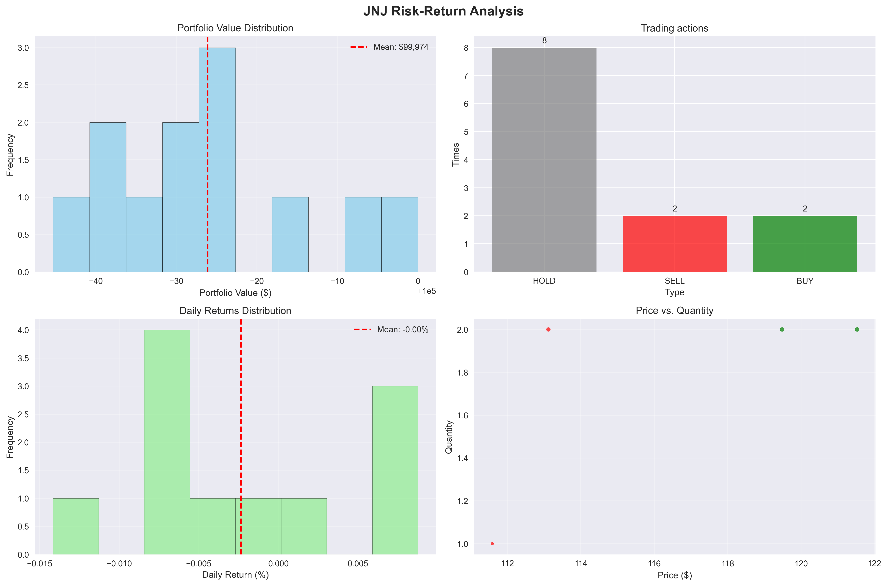

# 📊 投资组合表现报告

## 🔍 基本信息

- **实验名称**: 250808_230347_Qwen_Qwen3-8B_JNJ
- **运行时间**: 2025-08-08 23:12:56
- **模型**: Qwen_Qwen3-8B
- **交易标的**: JNJ

## ⚙️ 实验配置

### 模型配置
| 参数 | 值 |
|------|----|
| 模型 | Qwen/Qwen3-8B |
| 模型类型 | instruction |
| 温度参数 | 0.6 |
| 最大tokens | 500 |
| 嵌入模型 | Qwen/Qwen3-Embedding-4B |

### 交易配置
| 参数 | 值 |
|------|----|
| 交易标的 | JNJ |
| 预热期间 | 2020-03-12 至 2020-03-20 |
| 测试期间 | 2020-03-23 至 2020-03-31 |
| 初始资金 | $100,000.00 |
| 组合类型 | single-asset |
| 回望窗口 | 3 天 |

## 🎯 投资组合表现

| 指标 | 数值 | 说明 |
|------|------|------|
| 初始资金 | $100,000.00 | 投资组合起始价值 |
| 最终价值 | $99,974.13 | 投资组合结束价值 |
| 总收益 | $-25.87 | 绝对收益金额 |
| 收益率 | -0.03% | 相对收益百分比 |
| 年化收益率 | -0.54% | 按252个交易日年化 |
| 最大投资组合价值 | $100,000.00 | 期间最高价值 |
| 最小投资组合价值 | $99,954.67 | 期间最低价值 |

## ⚠️ 风险分析

| 风险指标 | 数值 | 评估 |
|----------|------|------|
| 波动率 | 0.11% | 较低 |
| 夏普比率 | -5.31 | 一般 |
| 最大回撤 | 0.05% | 较低 |

## 📈 策略表现对比

| 交易统计 | 数值 |
|----------|------|
| 总交易次数 | 4 |
| 买入交易 | 2 次 |
| 卖出交易 | 2 次 |
| 持有决策 | 8 次 |
| 胜率 | 0.0% |

| 基准比较 | 本策略 | Buy & Hold | 差异 |
|----------|---------|------------|------|
| 收益率 | -0.03% | 3.29% | -3.32% |
| 表现 | ❌ 跑输基准 | 基准策略 | Alpha < 0 |

## 📋 交易明细

| 日期 | 动作 | 数量 | 价格 ($) | 交易价值 ($) | 投资组合价值 ($) | 决策理由 |
|------|------|------|----------|------------|----------------|----------|
| 2020-03-12 | SELL | 1 | $111.59 | $111.59 | $100,000.00 | N/A |
| 2020-03-13 | BUY | 2 | $119.49 | $238.97 | $99,992.10 | N/A |
| 2020-03-16 | SELL | 2 | $113.12 | $226.23 | $99,985.73 | N/A |
| 2020-03-17 | BUY | 2 | $121.53 | $243.07 | $99,977.31 | N/A |
| 2020-03-18 | HOLD | 0 | $120.08 | $0.00 | $99,975.86 | N/A |
| 2020-03-19 | HOLD | 0 | $113.04 | $0.00 | $99,968.82 | N/A |
| 2020-03-23 | HOLD | 0 | $98.89 | $0.00 | $99,954.67 | N/A |
| 2020-03-24 | HOLD | 0 | $106.04 | $0.00 | $99,961.82 | N/A |
| 2020-03-25 | HOLD | 0 | $106.24 | $0.00 | $99,962.02 | N/A |
| 2020-03-26 | HOLD | 0 | $112.62 | $0.00 | $99,968.40 | N/A |
| 2020-03-27 | HOLD | 0 | $109.58 | $0.00 | $99,965.36 | N/A |
| 2020-03-30 | HOLD | 0 | $118.35 | $0.00 | $99,974.13 | N/A |

## 📈 可视化图表

### Portfolio Value vs Asset Price

### Cumulative Returns Comparison

### Trading Signals Analysis

### Risk-Return Analysis

## 📋 执行状态

- **Warmup阶段**: ✅ 已完成
- **Test阶段**: ✅ 已完成 
- **最终结果**: ✅ 已生成

## 📁 输出文件

- **交易记录**: `trading_results.csv`
- **可视化图表**: `charts/` 目录
- **运行日志**: `log/` 目录
- **实验元数据**: `metadata.json`

---

*报告生成时间: 2025-08-08 23:12:56*  
*INVESTOR-BENCH - 大语言模型投资决策评估框架*
