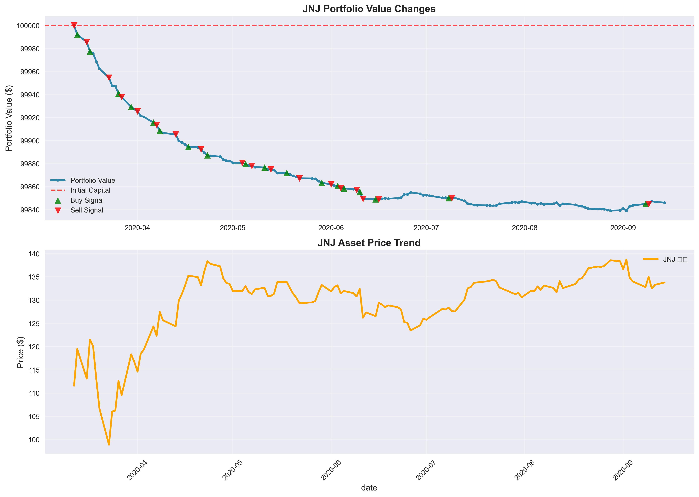
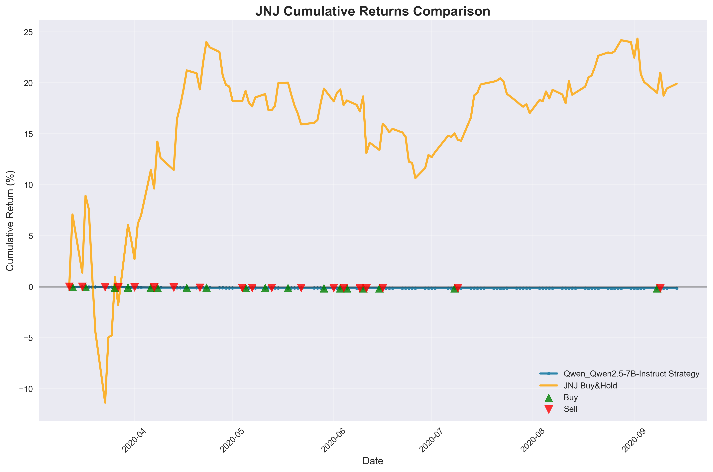
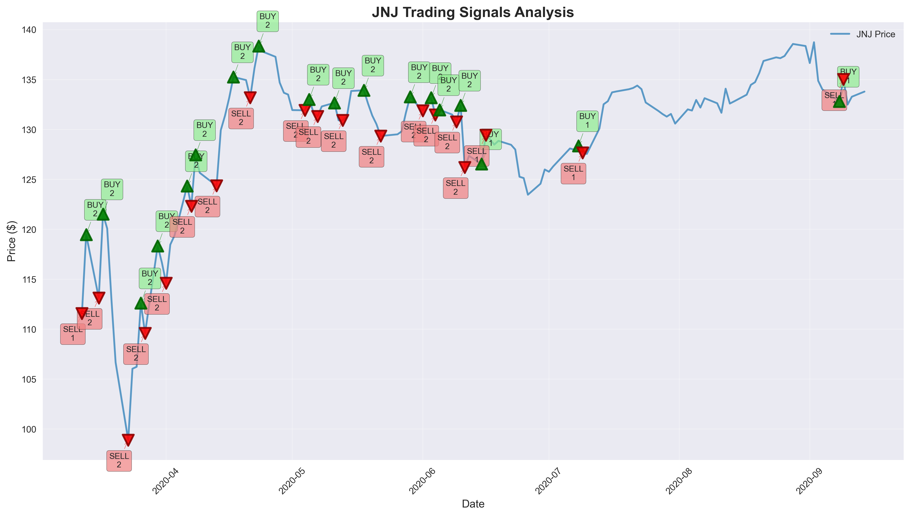
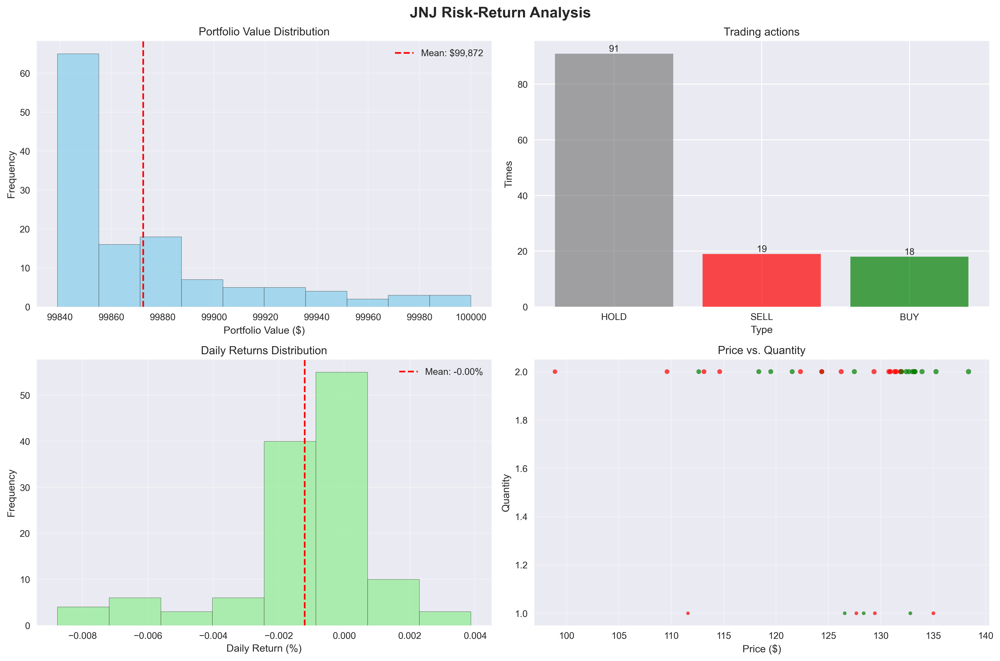

# 📊 投资组合表现报告

## 🔍 基本信息

- **实验名称**: 250808_235624_Qwen_Qwen2.5-7B-Instruct_JNJ
- **运行时间**: 2025-08-09 00:23:45
- **模型**: Qwen_Qwen2.5-7B-Instruct
- **交易标的**: JNJ

## ⚙️ 实验配置

### 模型配置
| 参数 | 值 |
|------|----|
| 模型 | Qwen/Qwen2.5-7B-Instruct |
| 模型类型 | instruction |
| 温度参数 | 0.6 |
| 最大tokens | 500 |
| 嵌入模型 | Qwen/Qwen3-Embedding-4B |

### 交易配置
| 参数 | 值 |
|------|----|
| 交易标的 | JNJ |
| 预热期间 | 2020-03-12 至 2020-06-12 |
| 测试期间 | 2020-06-15 至 2020-09-15 |
| 初始资金 | $100,000.00 |
| 组合类型 | single-asset |
| 回望窗口 | 3 天 |

## 🎯 投资组合表现

| 指标 | 数值 | 说明 |
|------|------|------|
| 初始资金 | $100,000.00 | 投资组合起始价值 |
| 最终价值 | $99,846.14 | 投资组合结束价值 |
| 总收益 | $-153.86 | 绝对收益金额 |
| 收益率 | -0.15% | 相对收益百分比 |
| 年化收益率 | -0.30% | 按252个交易日年化 |
| 最大投资组合价值 | $100,000.00 | 期间最高价值 |
| 最小投资组合价值 | $99,839.00 | 期间最低价值 |

## ⚠️ 风险分析

| 风险指标 | 数值 | 评估 |
|----------|------|------|
| 波动率 | 0.04% | 较低 |
| 夏普比率 | -8.65 | 一般 |
| 最大回撤 | 0.16% | 较低 |

## 📈 策略表现对比

| 交易统计 | 数值 |
|----------|------|
| 总交易次数 | 37 |
| 买入交易 | 18 次 |
| 卖出交易 | 19 次 |
| 持有决策 | 91 次 |
| 胜率 | 0.0% |

| 基准比较 | 本策略 | Buy & Hold | 差异 |
|----------|---------|------------|------|
| 收益率 | -0.15% | 3.29% | -3.44% |
| 表现 | ❌ 跑输基准 | 基准策略 | Alpha < 0 |

## 📋 交易明细

| 日期 | 动作 | 数量 | 价格 ($) | 交易价值 ($) | 投资组合价值 ($) | 决策理由 |
|------|------|------|----------|------------|----------------|----------|
| 2020-03-12 | SELL | 1 | $111.59 | $111.59 | $100,000.00 | N/A |
| 2020-03-13 | BUY | 2 | $119.49 | $238.97 | $99,992.10 | N/A |
| 2020-03-16 | SELL | 2 | $113.12 | $226.23 | $99,985.73 | N/A |
| 2020-03-17 | BUY | 2 | $121.53 | $243.07 | $99,977.31 | N/A |
| 2020-03-18 | HOLD | 0 | $120.08 | $0.00 | $99,975.86 | N/A |
| 2020-03-19 | HOLD | 0 | $113.04 | $0.00 | $99,968.82 | N/A |
| 2020-03-20 | HOLD | 0 | $106.67 | $0.00 | $99,962.45 | N/A |
| 2020-03-23 | SELL | 2 | $98.89 | $197.78 | $99,954.67 | N/A |
| 2020-03-24 | HOLD | 0 | $106.04 | $0.00 | $99,947.51 | N/A |
| 2020-03-25 | HOLD | 0 | $106.24 | $0.00 | $99,947.32 | N/A |
| 2020-03-26 | BUY | 2 | $112.62 | $225.23 | $99,940.94 | N/A |
| 2020-03-27 | SELL | 2 | $109.58 | $219.17 | $99,937.90 | N/A |
| 2020-03-30 | BUY | 2 | $118.35 | $236.70 | $99,929.14 | N/A |
| 2020-03-31 | HOLD | 0 | $116.67 | $0.00 | $99,927.47 | N/A |
| 2020-04-01 | SELL | 2 | $114.61 | $229.22 | $99,925.40 | N/A |
| 2020-04-02 | HOLD | 0 | $118.47 | $0.00 | $99,921.54 | N/A |
| 2020-04-03 | HOLD | 0 | $119.38 | $0.00 | $99,920.63 | N/A |
| 2020-04-06 | BUY | 2 | $124.35 | $248.71 | $99,915.66 | N/A |
| 2020-04-07 | SELL | 2 | $122.32 | $244.65 | $99,913.63 | N/A |
| 2020-04-08 | BUY | 2 | $127.47 | $254.94 | $99,908.49 | N/A |
| 2020-04-09 | HOLD | 0 | $125.66 | $0.00 | $99,906.68 | N/A |
| 2020-04-13 | SELL | 2 | $124.36 | $248.72 | $99,905.38 | N/A |
| 2020-04-14 | HOLD | 0 | $129.93 | $0.00 | $99,899.81 | N/A |
| 2020-04-15 | HOLD | 0 | $131.38 | $0.00 | $99,898.36 | N/A |
| 2020-04-16 | HOLD | 0 | $133.17 | $0.00 | $99,896.57 | N/A |
| 2020-04-17 | BUY | 2 | $135.26 | $270.52 | $99,894.48 | N/A |
| 2020-04-20 | HOLD | 0 | $134.95 | $0.00 | $99,894.17 | N/A |
| 2020-04-21 | SELL | 2 | $133.18 | $266.36 | $99,892.40 | N/A |
| 2020-04-22 | HOLD | 0 | $136.12 | $0.00 | $99,889.46 | N/A |
| 2020-04-23 | BUY | 2 | $138.37 | $276.73 | $99,887.21 | N/A |
| 2020-04-24 | HOLD | 0 | $137.79 | $0.00 | $99,886.64 | N/A |
| 2020-04-27 | HOLD | 0 | $137.28 | $0.00 | $99,886.13 | N/A |
| 2020-04-28 | HOLD | 0 | $134.70 | $0.00 | $99,883.55 | N/A |
| 2020-04-29 | HOLD | 0 | $133.68 | $0.00 | $99,882.52 | N/A |
| 2020-04-30 | HOLD | 0 | $133.50 | $0.00 | $99,882.35 | N/A |
| 2020-05-01 | HOLD | 0 | $131.94 | $0.00 | $99,880.79 | N/A |
| 2020-05-04 | SELL | 2 | $131.93 | $263.85 | $99,880.77 | N/A |
| 2020-05-05 | BUY | 2 | $133.02 | $266.04 | $99,879.68 | N/A |
| 2020-05-06 | HOLD | 0 | $131.76 | $0.00 | $99,878.41 | N/A |
| 2020-05-07 | SELL | 2 | $131.32 | $262.64 | $99,877.98 | N/A |
| 2020-05-08 | HOLD | 0 | $132.31 | $0.00 | $99,876.99 | N/A |
| 2020-05-11 | BUY | 2 | $132.67 | $265.35 | $99,876.63 | N/A |
| 2020-05-12 | HOLD | 0 | $130.92 | $0.00 | $99,874.87 | N/A |
| 2020-05-13 | SELL | 2 | $130.91 | $261.82 | $99,874.86 | N/A |
| 2020-05-14 | HOLD | 0 | $131.36 | $0.00 | $99,874.41 | N/A |
| 2020-05-15 | HOLD | 0 | $133.86 | $0.00 | $99,871.92 | N/A |
| 2020-05-18 | BUY | 2 | $133.93 | $267.85 | $99,871.85 | N/A |
| 2020-05-19 | HOLD | 0 | $132.59 | $0.00 | $99,870.51 | N/A |
| 2020-05-20 | HOLD | 0 | $131.40 | $0.00 | $99,869.32 | N/A |
| 2020-05-21 | HOLD | 0 | $130.54 | $0.00 | $99,868.46 | N/A |
| 2020-05-22 | SELL | 2 | $129.35 | $258.69 | $99,867.27 | N/A |
| 2020-05-26 | HOLD | 0 | $129.52 | $0.00 | $99,867.10 | N/A |
| 2020-05-27 | HOLD | 0 | $129.81 | $0.00 | $99,866.80 | N/A |
| 2020-05-28 | HOLD | 0 | $131.68 | $0.00 | $99,864.94 | N/A |
| 2020-05-29 | BUY | 2 | $133.27 | $266.54 | $99,863.34 | N/A |
| 2020-06-01 | SELL | 2 | $131.87 | $263.74 | $99,861.94 | N/A |
| 2020-06-02 | HOLD | 0 | $132.82 | $0.00 | $99,860.99 | N/A |
| 2020-06-03 | BUY | 2 | $133.18 | $266.36 | $99,860.64 | N/A |
| 2020-06-04 | SELL | 2 | $131.46 | $262.92 | $99,858.92 | N/A |
| 2020-06-05 | BUY | 2 | $131.97 | $263.94 | $99,858.40 | N/A |
| 2020-06-08 | HOLD | 0 | $131.50 | $0.00 | $99,857.93 | N/A |
| 2020-06-09 | SELL | 2 | $130.77 | $261.54 | $99,857.20 | N/A |
| 2020-06-10 | BUY | 2 | $132.42 | $264.84 | $99,855.56 | N/A |
| 2020-06-11 | SELL | 2 | $126.21 | $252.42 | $99,849.35 | N/A |
| 2020-06-15 | BUY | 1 | $126.55 | $126.55 | $99,849.01 | N/A |
| 2020-06-16 | SELL | 1 | $129.43 | $129.43 | $99,849.01 | N/A |
| 2020-06-17 | HOLD | 0 | $129.03 | $0.00 | $99,849.40 | N/A |
| 2020-06-18 | HOLD | 0 | $128.49 | $0.00 | $99,849.95 | N/A |
| 2020-06-19 | HOLD | 0 | $128.86 | $0.00 | $99,849.57 | N/A |
| 2020-06-22 | HOLD | 0 | $128.47 | $0.00 | $99,849.97 | N/A |
| 2020-06-23 | HOLD | 0 | $127.99 | $0.00 | $99,850.44 | N/A |
| 2020-06-24 | HOLD | 0 | $125.27 | $0.00 | $99,853.16 | N/A |
| 2020-06-25 | HOLD | 0 | $125.13 | $0.00 | $99,853.30 | N/A |
| 2020-06-26 | HOLD | 0 | $123.47 | $0.00 | $99,854.96 | N/A |
| 2020-06-29 | HOLD | 0 | $124.57 | $0.00 | $99,853.86 | N/A |
| 2020-06-30 | HOLD | 0 | $125.99 | $0.00 | $99,852.44 | N/A |
| 2020-07-01 | HOLD | 0 | $125.77 | $0.00 | $99,852.66 | N/A |
| 2020-07-02 | HOLD | 0 | $126.30 | $0.00 | $99,852.13 | N/A |
| 2020-07-06 | HOLD | 0 | $128.10 | $0.00 | $99,850.33 | N/A |
| 2020-07-07 | HOLD | 0 | $127.98 | $0.00 | $99,850.45 | N/A |
| 2020-07-08 | BUY | 1 | $128.36 | $128.36 | $99,850.07 | N/A |
| 2020-07-09 | SELL | 1 | $127.66 | $127.66 | $99,850.07 | N/A |
| 2020-07-10 | HOLD | 0 | $127.55 | $0.00 | $99,850.18 | N/A |
| 2020-07-13 | HOLD | 0 | $130.10 | $0.00 | $99,847.64 | N/A |
| 2020-07-14 | HOLD | 0 | $132.53 | $0.00 | $99,845.21 | N/A |
| 2020-07-15 | HOLD | 0 | $132.83 | $0.00 | $99,844.90 | N/A |
| 2020-07-16 | HOLD | 0 | $133.72 | $0.00 | $99,844.02 | N/A |
| 2020-07-17 | HOLD | 0 | $133.81 | $0.00 | $99,843.93 | N/A |
| 2020-07-20 | HOLD | 0 | $134.03 | $0.00 | $99,843.70 | N/A |
| 2020-07-21 | HOLD | 0 | $134.16 | $0.00 | $99,843.58 | N/A |
| 2020-07-22 | HOLD | 0 | $134.40 | $0.00 | $99,843.34 | N/A |
| 2020-07-23 | HOLD | 0 | $134.04 | $0.00 | $99,843.69 | N/A |
| 2020-07-24 | HOLD | 0 | $132.71 | $0.00 | $99,845.03 | N/A |
| 2020-07-27 | HOLD | 0 | $131.86 | $0.00 | $99,845.87 | N/A |
| 2020-07-28 | HOLD | 0 | $131.55 | $0.00 | $99,846.18 | N/A |
| 2020-07-29 | HOLD | 0 | $131.29 | $0.00 | $99,846.44 | N/A |
| 2020-07-30 | HOLD | 0 | $131.56 | $0.00 | $99,846.18 | N/A |
| 2020-07-31 | HOLD | 0 | $130.59 | $0.00 | $99,847.14 | N/A |
| 2020-08-03 | HOLD | 0 | $132.02 | $0.00 | $99,845.72 | N/A |
| 2020-08-04 | HOLD | 0 | $131.90 | $0.00 | $99,845.83 | N/A |
| 2020-08-05 | HOLD | 0 | $132.96 | $0.00 | $99,844.78 | N/A |
| 2020-08-06 | HOLD | 0 | $132.19 | $0.00 | $99,845.54 | N/A |
| 2020-08-07 | HOLD | 0 | $133.14 | $0.00 | $99,844.60 | N/A |
| 2020-08-10 | HOLD | 0 | $132.62 | $0.00 | $99,845.11 | N/A |
| 2020-08-11 | HOLD | 0 | $131.68 | $0.00 | $99,846.06 | N/A |
| 2020-08-12 | HOLD | 0 | $134.09 | $0.00 | $99,843.65 | N/A |
| 2020-08-13 | HOLD | 0 | $132.60 | $0.00 | $99,845.14 | N/A |
| 2020-08-14 | HOLD | 0 | $132.81 | $0.00 | $99,844.92 | N/A |
| 2020-08-17 | HOLD | 0 | $133.48 | $0.00 | $99,844.25 | N/A |
| 2020-08-18 | HOLD | 0 | $134.47 | $0.00 | $99,843.26 | N/A |
| 2020-08-19 | HOLD | 0 | $134.74 | $0.00 | $99,842.99 | N/A |
| 2020-08-20 | HOLD | 0 | $135.66 | $0.00 | $99,842.07 | N/A |
| 2020-08-21 | HOLD | 0 | $136.86 | $0.00 | $99,840.87 | N/A |
| 2020-08-24 | HOLD | 0 | $137.22 | $0.00 | $99,840.51 | N/A |
| 2020-08-25 | HOLD | 0 | $137.14 | $0.00 | $99,840.59 | N/A |
| 2020-08-26 | HOLD | 0 | $137.36 | $0.00 | $99,840.38 | N/A |
| 2020-08-27 | HOLD | 0 | $137.97 | $0.00 | $99,839.76 | N/A |
| 2020-08-28 | HOLD | 0 | $138.57 | $0.00 | $99,839.17 | N/A |
| 2020-08-31 | HOLD | 0 | $138.36 | $0.00 | $99,839.37 | N/A |
| 2020-09-01 | HOLD | 0 | $136.66 | $0.00 | $99,841.08 | N/A |
| 2020-09-02 | HOLD | 0 | $138.74 | $0.00 | $99,839.00 | N/A |
| 2020-09-03 | HOLD | 0 | $134.88 | $0.00 | $99,842.86 | N/A |
| 2020-09-04 | HOLD | 0 | $134.01 | $0.00 | $99,843.72 | N/A |
| 2020-09-08 | BUY | 1 | $132.81 | $132.81 | $99,844.92 | N/A |
| 2020-09-09 | SELL | 1 | $135.01 | $135.01 | $99,844.92 | N/A |
| 2020-09-10 | HOLD | 0 | $132.50 | $0.00 | $99,847.44 | N/A |
| 2020-09-11 | HOLD | 0 | $133.28 | $0.00 | $99,846.65 | N/A |
| 2020-09-14 | HOLD | 0 | $133.80 | $0.00 | $99,846.14 | N/A |

## 📈 可视化图表

### Portfolio Value vs Asset Price

### Cumulative Returns Comparison

### Trading Signals Analysis

### Risk-Return Analysis

## 📋 执行状态

- **Warmup阶段**: ✅ 已完成
- **Test阶段**: ✅ 已完成 
- **最终结果**: ✅ 已生成

## 📁 输出文件

- **交易记录**: `trading_results.csv`
- **可视化图表**: `charts/` 目录
- **运行日志**: `log/` 目录
- **实验元数据**: `metadata.json`

---

*报告生成时间: 2025-08-09 00:23:45*  
*INVESTOR-BENCH - 大语言模型投资决策评估框架*
