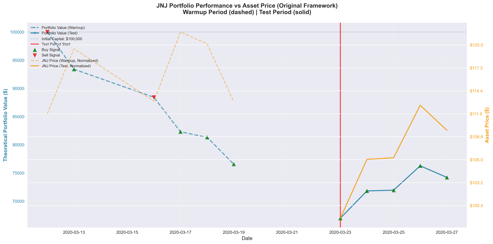
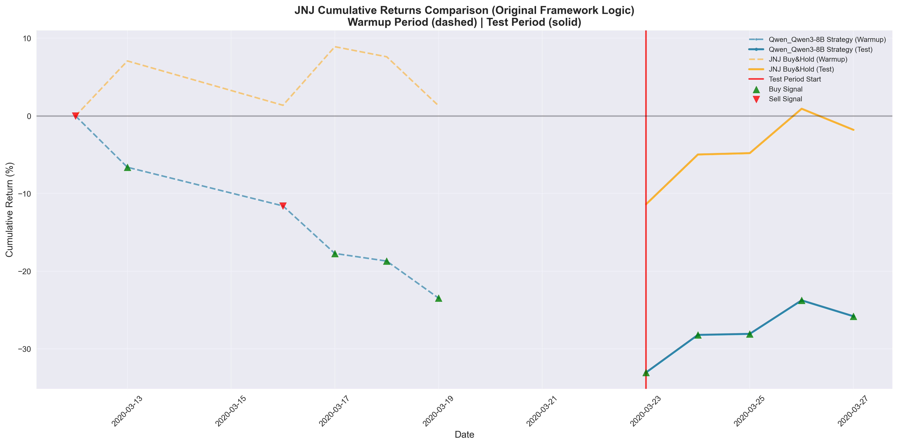
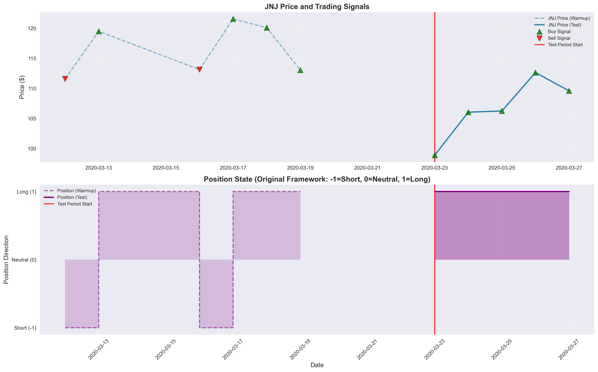
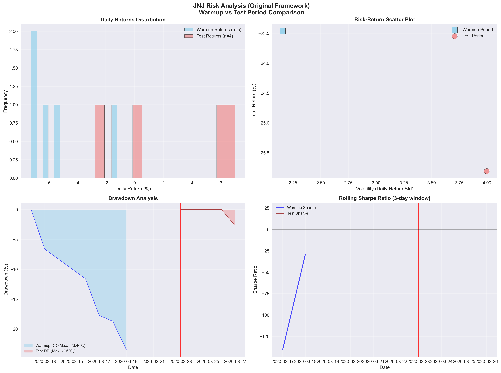

# 📊 投资组合表现报告

## 🔍 基本信息

- **实验名称**: 250810_003555_Qwen_Qwen3-8B_JNJ
- **运行时间**: 2025-08-10 00:43:59
- **模型**: Qwen_Qwen3-8B
- **交易标的**: JNJ

## ⚙️ 实验配置

### 模型配置
| 参数 | 值 |
|------|----|
| 模型 | Qwen/Qwen3-8B |
| 模型类型 | instruction |
| 温度参数 | 0.6 |
| 最大tokens | 500 |
| 嵌入模型 | Qwen/Qwen3-Embedding-4B |

### 交易配置
| 参数 | 值 |
|------|----|
| 交易标的 | JNJ |
| 预热期间 | 2020-03-12 至 2020-03-20 |
| 测试期间 | 2020-03-23 至 2020-03-30 |
| 初始资金 | $100,000.00 |
| 组合类型 | single-asset |
| 回望窗口 | 3 天 |

## 🎯 投资组合表现

| 指标 | 数值 | 说明 |
|------|------|------|
| 初始资金 | $100,000.00 | 投资组合起始价值 |
| 最终价值 | $100,000.00 | 投资组合结束价值 |
| 总收益 | $0.00 | 绝对收益金额 |
| 收益率 | 0.00% | 相对收益百分比 |
| 年化收益率 | 0.00% | 按252个交易日年化 |
| 最大投资组合价值 | $100,000.00 | 期间最高价值 |
| 最小投资组合价值 | $100,000.00 | 期间最低价值 |

## ⚠️ 风险分析

| 风险指标 | 数值 | 评估 |
|----------|------|------|
| 波动率 | 0.00% | 较低 |
| 夏普比率 | 0.00 | 一般 |
| 最大回撤 | 0.00% | 较低 |

## 📊 Position统计 (原始框架)

| Position统计 | 数值 | 比例 |
|-------------|------|------|
| 总决策次数 | 11 | 100.0% |
| Long Position (1) | 9 | 81.8% |
| Short Position (-1) | 2 | 18.2% |
| Neutral Position (0) | 0 | 0.0% |

## 📈 策略表现对比

| 基准比较 | 本策略 | Buy & Hold | 差异 |
|----------|---------|------------|------|
| 收益率 | 0.00% | 3.29% | -3.29% |
| 表现 | ❌ 跑输基准 | 基准策略 | Alpha < 0 |

## 📋 Position明细 (基于原始框架)

| 日期 | Position | Position描述 | 资产价格 ($) | 理论组合价值 ($) | 日收益率 (%) | 累计收益率 (%) | 阶段 |
|------|----------|------------|------------|-----------------|------------|--------------|------|
| 2020-03-12 | -1 | SHORT | $111.59 | $100,000.00 | 0.000% | 0.00% | warmup |
| 2020-03-13 | +1 | LONG | $119.49 | $93,387.45 | -6.841% | -6.61% | warmup |
| 2020-03-16 | -1 | SHORT | $113.12 | $88,408.27 | -5.479% | -11.59% | warmup |
| 2020-03-17 | +1 | LONG | $121.53 | $82,285.24 | -7.177% | -17.71% | warmup |
| 2020-03-18 | +1 | LONG | $120.08 | $81,303.29 | -1.201% | -18.70% | warmup |
| 2020-03-19 | +1 | LONG | $113.04 | $76,538.10 | -6.040% | -23.46% | warmup |
| 2020-03-23 | +1 | LONG | $98.89 | $66,953.51 | -13.379% | -33.05% | test |
| 2020-03-24 | +1 | LONG | $106.04 | $71,797.01 | 6.984% | -28.20% | test |
| 2020-03-25 | +1 | LONG | $106.24 | $71,929.56 | 0.184% | -28.07% | test |
| 2020-03-26 | +1 | LONG | $112.62 | $76,248.93 | 5.832% | -23.75% | test |
| 2020-03-27 | +1 | LONG | $109.58 | $74,194.68 | -2.731% | -25.81% | test |

## 📈 可视化图表

### Portfolio Value vs Asset Price

### Cumulative Returns Comparison

### Trading Signals Analysis

### Risk-Return Analysis

## 📋 执行状态

- **Warmup阶段**: ✅ 已完成
- **Test阶段**: ✅ 已完成 
- **最终结果**: ✅ 已生成

## 📁 输出文件

- **交易记录**: `trading_results.csv`
- **可视化图表**: `charts/` 目录
- **运行日志**: `log/` 目录
- **实验元数据**: `metadata.json`

---

*报告生成时间: 2025-08-10 00:43:59*  
*INVESTOR-BENCH - 大语言模型投资决策评估框架*
